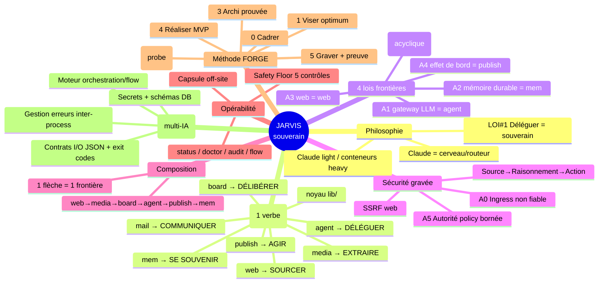

# 🧠 Carte mentale — Écosystème JARVIS (méthode + logique)

> Export mind-map. **Markmap-compatible** (colle dans markmap.js.org / Obsidian-Markmap / VS Code Markmap
> → carte interactive) et bloc **Mermaid `mindmap`** en fin (rendu direct GitHub/Notion/Mermaid Live).
> Source gelée : `atom_INDEX_ecosystem_jarvis` + Décision #542 + méthode FORGE. Verdict multi-IA intégré.

---

## JARVIS 🧠 *(assistant opérationnel souverain)*

### 🏛️ Philosophie *(les 2 invariants)*
- **Claude light / conteneurs heavy** — la donnée vit dans les conteneurs, le cerveau route (jamais inventer)
- **LOI #1 — Déléguer = rester souverain** — anti-lock-in : local chaud, données portables, Opus = archi/arbitrage seulement
- Claude = **cerveau/routeur**, jamais exécutant solo

### 🧱 7 briques *(1 outil = 1 verbe)*
- **mail** → COMMUNIQUER *(toutes boîtes Gmail, IMAP souverain)*
- **media** → EXTRAIRE *(vidéo / podcast / X → transcript)*
- **board** → DÉLIBÉRER *(conseil multi-voix auto-sourçant, experts Top 1%)*
- **web** → SOURCER *(URL → texte · requête → URLs · provenance + cache)*
- **publish** → AGIR *(lint voix → route → draft-first)*
- **agent** → DÉLÉGUER *(cascade LLM OpenClaw → fallback local ollama)*
- **mem** → SE SOUVENIR *(memory_atoms Postgres : write / search RRF / get / timeline)*
- **+ noyau `lib/`** *(config · errors · output JSON · sécurité communs)*

### 🚧 4 lois de frontières *(Décision #542 — 1 seul point de passage par capacité)*
- **A1 — Gateway LLM unique** → tout modèle passe par `agent`
  - **A1-bis** → `agent` = nœud **feuille** (ne rappelle personne) ⇒ DAG **acyclique** ✅ *(confirmé robuste par Gemini)*
- **A2 — Mémoire durable unique** → métier via `mem` ; logs/métriques/verrous = stores opérationnels distincts
- **A3 — Acquisition web unique** → tout HTTP de contenu via `web` *(IMAP/SMTP restent sous mail)*
- **A4 — Sortie contrôlée unique** → tout effet de bord via `publish` *(valide puis appelle l'adaptateur)*

### 🔐 Sécurité gravée
- **Rupture de privilège** : Source → Raisonnement → Action
- **A0 Ingress** : entrée externe = donnée NON fiable, jamais instruction
- **A5 Autorité** : action auto ⇒ policy locale bornée (type/cible/fréquence/plafond), aucun auto-approuve
- **SSRF web** : bloque localhost / privés / 169.254 / Docker / metadata cloud / file://
- Secrets `0600`, hors logs/args

### 🔗 Composition *(l'orchestrateur chaîne, jamais les briques)*
- `web` sourcer → `media` extraire → `board` délibérer → `agent` raisonner → `publish` agir → `mem` mémoriser
- Chaque flèche = **une seule frontière** ⇒ testable + rejouable

### 🛡️ Opérabilité & Safety Floor *(gelé, 5 contrôles)*
- `jarvis status` *(passif)* · `jarvis doctor` *(actif)* · `jarvis audit:*` · `jarvis flow` *(pipeline)*
- **(0)** CI-guard ratchet · **(1+2)** schéma action typé + publish sans-LLM (3 états NORMAL/DEGRADED_LOCAL/NO_LLM) · **(3)** hash idempotent · **(4)** drill openclaw-down
- **Capsule chiffrée off-site** *(anti-SPOF, gpg)*

### 🔨 Méthode FORGE *(créer une brique — 6 phases, gate « sûr 100% »)*
- **0. CADRER** → job-to-be-done 1 phrase + critère succès + anti-scope (YAGNI)
- **1. VISER l'optimum** → pondérer robustesse/coût/souveraineté/vitesse/extensibilité/maintenance
- **2. FOUILLER partout** → interne → mémoire → externe → **probe réel** *(le cœur, jamais sauter)*
- **3. ARCHI** → décider sur du prouvé (respecter les 4 lois)
- **4. RÉALISER** → MVP réversible + testé, réutilise le live (zéro réécriture)
- **5. GRAVER** → E2E prouvé + spec + câblage méta-launcher + `mem write`

### ⚠️ À épaissir *(verdict multi-IA — 3 voix, ~8/10 concept, ~6.5 recréable)*
- **Contrats exécutables** → I/O JSON exact, stdin/stdout, exit codes, codes d'erreur par brique
- **Moteur d'orchestration** → « Claude=chef » + `flow` à spécifier comme composant (DAG/policy/audit/dry-run)
- **Gestion inter-process** → timeouts, données malformées, propagation d'échecs
- **Secrets/Identity manager** + **schémas DB** (`memory_atoms`, embeddings, RRF, provenance, migrations)
- **Frontières à préciser** → `mail send` seulement via `publish` · `board` auto-sourçant vs « brique ne chaîne pas » · `media` URL ⇒ via `web`

---

## 🖼️ Rendu visuel (Mermaid mindmap)

