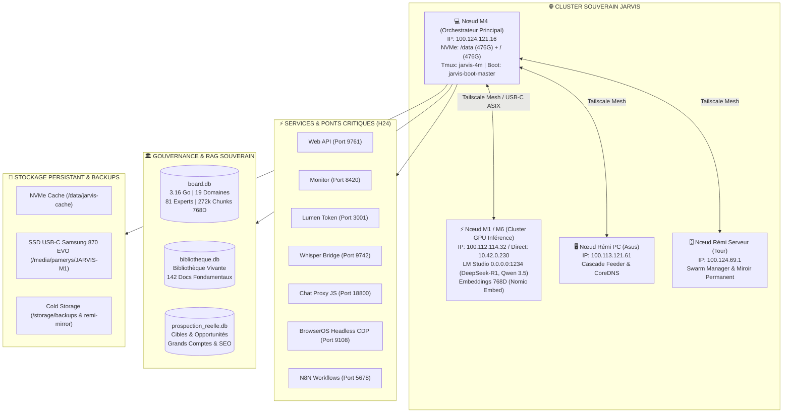

# 🗺️ CARTE MENTALE & ARCHITECTURE UNIFIÉE DU CLUSTER JARVIS

---

## 1. Topologie Globale du Cluster 4 Machines

---

## 2. Chaîne de Démarrage & Persistance au Boot

1. **Service Systemd de Boot ([`jarvis-boot-master.service`](file:///etc/systemd/system/jarvis-boot-master.service)) :**
   - Calibrage du gouverneur CPU et politique énergétique `balance_performance`.
   - Raccordement des liens NVMe et montage SSD USB-C M1.
   - Initialisation automatique de la session `tmux jarvis-4m` reliant les 4 machines.
2. **Superviseur H24 ([`jarvis-h24-daemon.service`](file:///etc/systemd/system/jarvis-h24-daemon.service)) :**
   - Surveillance continue et auto-restart des ponts 9761, 8420, 3001, 9742, 18800.
3. **Conteneurs Docker (`unless-stopped`) :**
   - `jv-ia-browseros` (CDP 9108) et `jarvis-n8n` (5678).

---

## 3. Matrice des 7 Portails IA Web Câblés

| # | Plateforme IA | URL | Mode de Contrôle |
|---|---|---|---|
| 1 | **NotebookLM** | `https://notebooklm.google.com` | Headless CDP / Ingestion RAG & Podcasts |
| 2 | **Google Gemini** | `https://gemini.google.com` | Inférence Multimodale & Synthèse |
| 3 | **Google AI Studio** | `https://aistudio.google.com` | Prototypage rapide 2.0 / 1.5 Pro |
| 4 | **OpenAI ChatGPT** | `https://chatgpt.com` | Benchmarks & Prompts |
| 5 | **Manus AI Agent** | `https://app.manus.im` | Délégation de missions de crawl |
| 6 | **Mistral Le Chat** | `https://chat.mistral.ai` | Inférence Européenne Souveraine |
| 7 | **Perplexity AI** | `https://www.perplexity.ai` | Moisson de veille sourcée |

---

## 4. Stratégie de Prospection & SEO LinkedIn

- **Ciblage Décideurs :** Directeurs IA, CTO et Achats (Airbus, Thales, BPCE, Continental).
- **SEO & Mots-clés :** *Orchestration Multi-Agents, LLM Souverain, FinOps IA, RAG 768D, EU AI Act*.
- **Table Ronde :** Intégration de l'expert `agent-browseros-action` pour exécuter les publications et captures web à 0 token payant.
