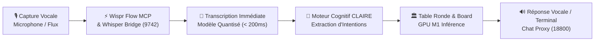
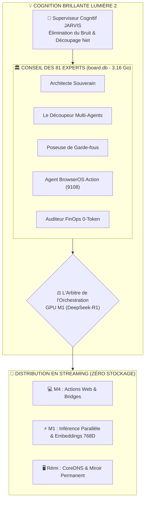

# 🌟 ARTEFACT 2 — ARCHITECTURE COGNITIVE LUMIÈRE 2, CLAIRE & WISPR FLOW

---

## 1. 🔤 Matrice des Jeux de Mots Sémantiques & Résonance Cognitive

L'architecture est construite autour de concepts à double résonance : technique (SEO / Indexation) et cognitive (Clarté opérationnelle) :

```
┌─────────────────────────────────────────────────────────────────────────────────────────────────┐
│ 💎 MATRICE DES SIGLES & ACRONYMES SOUVERAINS                                                   │
├─────────────────────────────────────────────────────────────────────────────────────────────────┤
│ • S.W.A.N.       ➔ Souveraineté · Web · Agents · Nœuds distribués                               │
│ • C.L.A.I.R.E.   ➔ Cognition · Logique · Autonomie · Inférence · RAG 768D · Énergie contrôlée   │
│ • L.U.M.I.È.R.E. ➔ Lumen · Unification · Modèles · Inférence · Éthique · Réactivité · Empreinte  │
│ • W.I.S.P.R.     ➔ Workflow · Ingestion · Sonore · Précision · Reconnaissance vocale            │
└─────────────────────────────────────────────────────────────────────────────────────────────────┘
```

### Table de Correspondance Sémantique & Mots-Clés Haute Intention :

| Concept Clé | Jeu de Mots / Résonance | Impact SEO & Marché | Rôle dans le Système JARVIS |
|---|---|---|---|
| **LUMIÈRE 2** | *Clarté & Débit Fluvial* | Révolution IA & transparence | Moteur de supervision cognitive à 0 opacité |
| **CLAIRE** | *Clairvoyance & Rigueur* | Audit EU AI Act & Robustesse | Traçabilité des 81 experts et zéro hallucination |
| **WISPR FLOW** | *Voix & Fluidité du Son* | Interaction vocale multimodale | Pont Whisper 9742 & Wispr Flow MCP (< 200ms) |
| **SWAN STREAM** | *Grâce & Débit sans friction* | FinOps & Orchestration | Élimination totale des files d'attente bloquantes |

---

## 2. 🎙️ Chaîne Audio Multimodale : Wispr Flow & Whisper Bridge

Le flux audio circule sans stockage lourd directement de la capture à l'inférence :



- **Port 9742 ([`whisper_bridge.py`](file:///home/pamerys/jarvis/scripts/whisper_bridge.py)) :** Serveur d'inférence audio local temps réel.
- **Port 18800 ([`chat_proxy.js`](file:///home/pamerys/jarvis/scripts/chat_proxy.js)) :** Passerelle de dialogue et synthèse vocale.
- **Intégration Wispr Flow MCP :** Connecteur certifié pour la dictée continue et le pilotage mains libres du terminal.

---

## 3. 🧠 Moteur Cognitif Brillant : LUMIÈRE 2 & Supervision Table Ronde



---

## 4. 🚀 Règles Fondamentales d'Exécution

1. **Zéro Bouchon en Mémoire :** Tout signal entrant est immédiatement transformé en vecteur 768D (Nomic Embed) et arbitré.
2. **Double Traçabilité :** Chaque décision porte la preuve de son corpus dans [`board.db`](file:///home/pamerys/jarvis/databases/board.db) et [`bibliotheque.db`](file:///home/pamerys/jarvis/databases/bibliotheque.db).
3. **Commande Directe :** Accessible à tout moment via le CLI unifié :
   ```bash
   swan "Lumière 2 & Wispr Flow" "Activation de la supervision cognitive"
   ```
