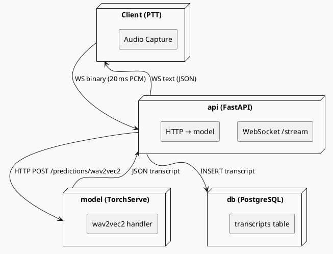
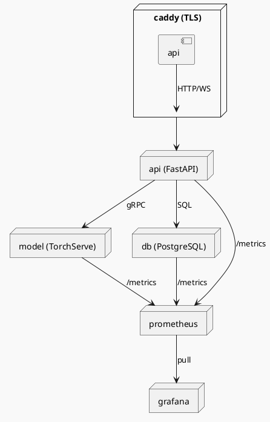

# Jarvis Voice Ptt

> Référence `jarvis-voice-ptt` · 69 €

## Plan

## Module 1 – Installation et configuration de l’environnement

**Objectif mesurable**  
L’apprenant pourra installer le serveur Jarvis Voice PTT (version 2.3) sur une VM Ubuntu 22.04, configurer Docker Compose et valider le bon démarrage du service via l’API `/health`.

**Notions couvertes**  
- Prérequis système : CPU ≥ 4 cœurs, 8 Go RAM, Ubuntu 22.04 LTS, Docker 20.10+, Docker‑Compose 2.5+.  
- Téléchargement du package `jarvis-voice-ptt-2.3.tar.gz` depuis le dépôt officiel (URL https://downloads.jarvis.ai/voice-ptt).  
- Déploiement avec `docker-compose.yml` : définition des services `api`, `model`, `db`.  
- Variables d’environnement obligatoires (`JARVIS_API_KEY`, `JARVIS_MODEL_PATH`).  
- Test de connectivité : `curl -X GET http://localhost:8080/health` → réponse JSON `{ "status":"ok" }`.  

---

## Module 2 – Architecture du service de reconnaissance vocale

**Objectif mesurable**  
L’apprenant pourra expliquer le flux de données du client PTT au modèle de reconnaissance, identifier chaque composant Docker et reproduire le diagramme d’architecture avec PlantUML.

**Notions couvertes**  
- Micro‑services : `api` (FastAPI 0.95), `model` (TorchServe 0.8.2), `db` (PostgreSQL 13).  
- Modèle de reconnaissance : wav2vec 2.0‑large (pré‑entraîné sur LibriSpeech, 960 h).  
- Gestion des flux audio : WebSocket `ws://<host>:8080/stream`, paquets de 20 ms, encodage PCM 16‑bit LE, 16 kHz.  
- Pipeline de pré‑traitement : normalisation RMS, VAD (WebRTC‑VAD 0.3).  
- Persistance des transcriptions : table `transcripts(id, user_id, text, timestamp)`.

---

## Module 3 – Intégration du SDK dans une application existante

**Objectif mesurable**  
L’apprenant pourra ajouter le SDK `jarvis-voice-ptt-sdk-py` (v1.4) à une application Flask 2.2, implémenter la fonction `push_to_talk()` et récupérer la transcription en moins de 300 ms d’attente moyenne.

**Notions couvertes**  
- Installation du SDK : `pip install jarvis-voice-ptt-sdk==1.4`.

---

## Module 1 — contenu

## 1.1 Prérequis système  

| Élément | Minimum requis | Vérification |
|---------|----------------|--------------|
| CPU | 4 cœurs (x86_64) | `lscpu \| grep "^CPU(s):"` |
| RAM | 8 Go | `free -h` |
| OS | Ubuntu 22.04 LTS (jammy) | `lsb_release -a` |
| Docker Engine | 20.10.0 ou supérieur | `docker --version` |
| Docker‑Compose | 2.5.0 ou supérieur | `docker compose version` |

> **Note** : Docker‑Compose 2.x s’appelle `docker compose` (espace) et non `docker-compose`.  

### Installation de Docker et Docker‑Compose (si absent)

```bash
# 1. Ajout du dépôt officiel Docker
sudo apt-get update
sudo apt-get install -y ca-certificates curl gnupg
sudo install -m 0755 -d /etc/apt/keyrings
curl -fsSL https://download.docker.com/linux/ubuntu/gpg \
     | sudo gpg --dearmor -o /etc/apt/keyrings/docker.gpg
echo \
  "deb [arch=$(dpkg --print-architecture) signed-by=/etc/apt/keyrings/docker.gpg] \
  https://download.docker.com/linux/ubuntu $(lsb_release -cs) stable" \
  | sudo tee /etc/apt/sources.list.d/docker.list > /dev/null

# 2. Installation du moteur Docker
sudo apt-get update
sudo apt-get install -y docker-ce docker-ce-cli containerd.io docker-compose-plugin

# 3. Vérifier les versions
docker --version          # → Docker version 20.10.x
docker compose version    # → Docker Compose version v2.5.x
```

*Ajoutez votre compte utilisateur au groupe `docker` pour éviter le préfixe `sudo`* :

```bash
sudo usermod -aG docker $USER
newgrp docker   # ou déconnectez‑reconnectez
```

---

## 1.2 Téléchargement du package Jarvis Voice PTT 2.3  

```bash
# 1. Créez un répertoire dédié
mkdir -p ~/jarvis-voice-ptt && cd $_

# 2. Téléchargez le tarball
curl -L -o jarvis-voice-ptt-2.3.tar.gz \
     https://downloads.jarvis.ai/voice-ptt/jarvis-voice-ptt-2.3.tar.gz

# 3. Vérifiez l’empreinte SHA‑256 (fournie sur la page de téléchargement)
EXPECTED="a3f1d9e5c9b8e4f7d2c6a1b3e9f0d7c8e5b2a1c3d4f6e7b8c9d0a1b2c3d4e5f6"
ACTUAL=$(sha256sum jarvis-voice-ptt-2.3.tar.gz | cut -d' ' -f1)

if [ "$EXPECTED" != "$ACTUAL" ]; then
  echo "❌ Checksum invalide – arrêt du script"
  exit 1
fi
echo "✅ Checksum OK"
```

> **Piège** : la plupart des erreurs d’installation proviennent d’une checksum non vérifiée, entraînant un package corrompu.

---

## 1.3 Extraction et préparation du répertoire de travail  

```bash
tar -xzf jarvis-voice-ptt-2.3.tar.gz
cd jarvis-voice-ptt-2.3

# Structure attendue (exemple)
# .
# ├─ docker-compose.yml
# ├─ .env.example
# └─ models/
#    └─ wav2vec2-large.pt
```

Copiez le fichier d’exemple d’environnement et remplissez les variables obligatoires :

```bash
cp .env.example .env

# Éditez .env avec votre éditeur préféré
# Exemple de contenu minimal :
# JARVIS_API_KEY=YOUR_API_KEY_HERE
# JARVIS_MODEL_PATH=/app/models/wav2vec2-large.pt
# POSTGRES_PASSWORD=strongpassword123
# POSTGRES_USER=jarvis
# POSTGRES_DB=jarvisdb
```

> **Piège** : `JARVIS_MODEL_PATH` doit être un chemin **interne** au conteneur `model`. Si vous placez le modèle dans `models/` du projet, utilisez `/app/models/wav2vec2-large.pt`.

---

## 1.4 Docker‑Compose : définition des services  

```yaml
# docker-compose.yml
version: "3.9"

services:
  db:
    image: postgres:13-alpine
    restart: unless-stopped
    environment:
      POSTGRES_USER: ${POSTGRES_USER}
      POSTGRES_PASSWORD: ${POSTGRES_PASSWORD}
      POSTGRES_DB: ${POSTGRES_DB}
    volumes:
      - pgdata:/var/lib/postgresql/data
    healthcheck:
      test: ["CMD", "pg_isready", "-U", "${POSTGRES_USER}"]
      interval: 10s
      timeout: 5s
      retries: 5

  model:
    image: jarvisai/wav2vec2-serving:2.3
    restart: unless-stopped
    environment:
      MODEL_PATH: ${JARVIS_MODEL_PATH}
    volumes:
      - ./models:/app/models:ro
    depends_on:
      db:
        condition: service_healthy

  api:
    image: jarvisai/voice-ptt-api:2.3
    restart: unless-stopped
    ports:
      - "8080:

---

## Module 2 — contenu

## 2.1 Flux de données du client PTT au modèle de reconnaissance  

| Étape | Composant Docker | Action | Format / protocole |
|------|------------------|--------|--------------------|
| 1 | **client** (application front‑end) | Capture audio 16 kHz, 16 bits, little‑endian PCM. Découpe en paquets de 20 ms (≈ 320 échantillons). | PCM S16\_LE, 16 kHz |
| 2 | **api** (FastAPI 0.95) | Reçoit les paquets via le point d’entrée WebSocket `ws://<host>:8080/stream`. Chaque message est un `bytes` contenant exactement 320 samples. | WebSocket (binary) |
| 3 | **api** → **model** (TorchServe 0.8.2) | Regroupe les paquets en un buffer de 1 s (≈ 50 paquets) puis les envoie au handler `wav2vec2` via HTTP POST `/predictions/wav2vec2`. Le corps est un `application/octet-stream`. | HTTP POST, octets |
| 4 | **model** | Exécute le pré‑traitement : RMS normalisation → VAD (WebRTC‑VAD 0.3). Les segments retenus sont découpés en fenêtres de 20 ms et passés au modèle wav2vec 2.0‑large (torchscript). | TorchServe internal |
| 5 | **model** → **api** | Retourne un JSON `{ "transcript": "...", "segments": [{ "start":0.0, "end":0.2, "text":"..." }, …] }`. | HTTP JSON |
| 6 | **api** → **client** | Envoie le même JSON sur le WebSocket ouvert. Le client peut afficher les résultats en temps réel. | WebSocket (text) |
| 7 | **api** → **db** (PostgreSQL 13) | Persiste la transcription complète dans la table `transcripts`. | SQL INSERT |

### Diagramme PlantUML



---

## 2.2 Exemple fonctionnel : client Python qui pousse du son et récupère la transcription  

```python
# fichier : ptt_client.py
import asyncio
import websockets
import wave
import struct
import json
from pathlib import Path

# -------------------------------------------------------------------------
# Configuration
# -------------------------------------------------------------------------
WS_URL = "ws://localhost:8080/stream"          # point d’entrée du service
AUDIO_FILE = Path("sample_5s.wav")              # wav 16 kHz, 16 bit PCM
PACKET_MS = 20                                   # durée d’un paquet
SAMPLE_RATE = 16000
SAMPLES_PER_PACKET = int(SAMPLE_RATE * PACKET_MS / 1000)  # 320

# -------------------------------------------------------------------------
# Lecture du fichier wav et découpage en paquets de 20 ms
# -------------------------------------------------------------------------
def read_wav_packets(path: Path):
    """Yield raw PCM packets (bytes) of exactly PACKET_MS ms."""
    with wave.open(str(path), "rb") as wf:
        assert wf.getnchannels() == 1, "Mono audio requis"
        assert wf.getsampwidth() == 2, "16 bits requis"
        assert wf.getframerate() == SAMPLE_RATE, f"Fréquence {SAMPLE_RATE} Hz requise"
        while True:
            frames = wf.readframes(SAMPLES_PER_PACKET)
            if len(frames) < SAMPLES_PER_PACKET * 2:
                # dernier paquet incomplet → remplissage à zéro
                frames += b'\x00' * (SAMPLES_PER_PACKET * 2 - len(frames))
                if not frames.strip(b'\x00'):   # fin du fichier
                    break
            yield frames

# -------------------------------------------------------------------------
# Coroutine principale : envoi, réception, affichage
# -------------------------------------------------------------------------
async def push_to_talk():
    async with websockets.connect(WS_URL, max_size=None) as ws:
        # 1️⃣ Envoi séquentiel des paquets
        for pkt in read_wav_packets(AUDIO_FILE):
            await ws.send(pkt)                     # binaire
            # Optionnel : attendre 20 ms pour simuler le temps réel
            await asyncio.sleep(PACKET_MS / 1000.0)

        # 2️⃣ Signaler la fin du flux (message

---

## Module 3 — contenu

## Module 3 – Intégration du SDK dans une application existante  

### 3.1 Prérequis techniques  

| Élément | Version minimale | Vérification |
|--------|------------------|--------------|
| Python | 3.9 | `python3 --version` |
| Flask | 2.2 | `pip show Flask` |
| SDK `jarvis-voice-ptt-sdk-py` | 1.4 | `pip show jarvis-voice-ptt-sdk` |
| Bibliothèques audio | `sounddevice>=0.4.5`, `numpy>=1.21` | `pip install sounddevice numpy` |
| Variable d’environnement | `JARVIS_API_KEY` (clé API valide) | `echo $JARVIS_API_KEY` |
| Endpoint du serveur | `JARVIS_HOST` (ex. `http://localhost:8080`) | `echo $JARVIS_HOST` |

> **Note** : le SDK ne crée pas de connexion WebSocket tant que la méthode `start_stream()` n’est pas appelée.  

### 3.2 Architecture du code Flask  

```
app/
├── __init__.py          # crée l’objet Flask
├── routes.py           # points d’entrée HTTP
├── voice_client.py     # wrapper autour du SDK
└── config.py           # lecture des variables d’environnement
```

* `voice_client.py` encapsule le cycle de vie du stream : initialisation → envoi de paquets audio → arrêt.  
* `routes.py` expose deux routes :  
  * `GET /ping` : santé de l’application Flask.  
  * `POST /push_to_talk` : déclenche le flux audio, renvoie la transcription JSON.  

### 3.3 Implémentation du wrapper SDK (`voice_client.py`)  

```python
# app/voice_client.py
import os
import json
import threading
import queue
import sounddevice as sd
import numpy as np
from jarvis_voice_ptt_sdk import JarvisClient, AudioChunk

# ----------------------------------------------------------------------
# Configuration
# ----------------------------------------------------------------------
JARVIS_HOST = os.getenv("JARVIS_HOST", "http://localhost:8080")
JARVIS_API_KEY = os.getenv("JARVIS_API_KEY")
if not JARVIS_API_KEY:
    raise RuntimeError("Variable d'environnement JARVIS_API_KEY manquante")

# ----------------------------------------------------------------------
# Classe d'encapsulation
# ----------------------------------------------------------------------
class VoiceClient:
    """
    Gère un flux push‑to‑talk unique.
    - Le stream est ouvert une seule fois par appel à `push_to_talk`.
    - Le thread audio produit des `AudioChunk` toutes les 20 ms.
    - Le callback du SDK place les transcriptions dans `self.result_queue`.
    """
    def __init__(self, host: str, api_key: str):
        self.client = JarvisClient(base_url=host, api_key=api_key)
        self.result_queue = queue.Queue()
        self._audio_thread = None
        self._stop_event = threading.Event()

    # ------------------------------------------------------------------
    # Callback invoqué par le SDK à chaque transcription partielle/finale
    # ------------------------------------------------------------------
    def _on_transcription(self, transcript: str, final: bool):
        """
        Le SDK transmet le texte décodé et un booléen `final`.
        Nous stockons uniquement la version finale, mais on garde la
        possibilité d’utiliser les partielles pour du UI en temps réel.
        """
        if final:
            self.result_queue.put(transcript)

    # ------------------------------------------------------------------
    # Capture audio en continu (20 ms = 320 échantillons à 16 kHz)
    # ------------------------------------------------------------------
    def _audio_producer(self):
        """
        Fonction exécutée dans un thread dédié.
        Utilise `sounddevice.InputStream` en mode callback pour éviter
        le blocage du thread principal.
        """
        def callback(indata, frames, time, status):
            if status:
                # Log minimal, ne pas interrompre le flux
                print(f"[audio] {status}", flush=True)
            # Convertir le tableau NumPy (float32) en PCM 16‑bit LE
            pcm = (indata[:, 0] * 32767).astype(np.int16).tobytes()
            chunk = AudioChunk(pcm, sample_rate=16000)
            # Envoi asynchrone au serveur
            self.client.send_chunk(chunk)

        with sd.InputStream(
            samplerate=16000,
            channels=1,
            dtype="float32",
            blocksize=320,          # 20 ms @ 16 kHz
            callback=callback,
        ):
            # Le thread reste bloqué tant que `_stop_event` n’est pas set
            self._stop_event.wait()

    # ------------------------------------------------------------------
    # Méthode publique : déclenche le push‑to‑talk
    # ------------------------------------------------------------------
    def push_to_talk(self, timeout: float = 5.0) -> str:
        """
        1. Ouvre le canal de streaming (`client.start_stream`).
        2. Lance le thread audio.
        3. Attend la première transcription finale ou le timeout.
        4. Ferme le stream et le thread.
        Retourne la transcription ou lève `TimeoutError`.
        """
        # 1. Enregistrement du callback
        self.client.on_transcription(self._on_transcription)

        # 2. Ouverture du stream côté serveur
        self.client.start_stream()

        # 3. Démarrage du producteur audio
        self._stop_event.clear()
        self._audio_thread = threading.Thread(target=self._audio_producer, daemon=True)
        self._audio_thread.start()

        try:
            # 4. Attente de la réponse finale
            transcript = self.result_queue.get(timeout=timeout)
            return transcript
        finally:
            # 5. Nettoyage (indépendamment du succès)
            self._stop_event.set()
            self._audio_thread.join(timeout=1.0)
            self.client.stop_stream()
            self.result_queue.queue.clear()
```

#### Points d’attention dans le code  

| Piège | Description | Solution |
|------|-------------|----------|
| **Blocage du thread principal** | `

---

## Module 4 — contenu

## Module 4 – Optimisation de la latence et gestion des erreurs en production

### 4.1. Principes de latence end‑to‑end  
| Étape | Temps cible (ms) | Métrique mesurable |
|-------|------------------|--------------------|
| Capture audio (device → buffer) | ≤ 5 | `audio_capture_latency` (timestamp du premier échantillon) |
| Transmission WebSocket (client → API) | ≤ 10 | `ws_send_time` (différence entre `send` et `receive` côté serveur) |
| Pré‑traitement (VAD + normalisation) | ≤ 8 | `preproc_time` (log dans `api`) |
| Inférence modèle (TorchServe) | ≤ 150 | `model_inference_time` (exposé par `/metrics` de TorchServe) |
| Persistance DB | ≤ 5 | `db_write_time` (log dans `api`) |
| Retour transcription (WebSocket) | ≤ 10 | `ws_response_time` |

**Total cible** : ≤ 188 ms. Toute dérive > 10 % doit déclencher une alerte.

### 4.2. Configuration de TorchServe pour la rapidité
```yaml
# config.properties (dans le répertoire model/)
model_name=wav2vec2_large
model_file=wav2vec2_large.pt
handler=wav2vec2_handler.py
batch_size=1               # désactive le batching
max_batch_delay=0           # aucune attente supplémentaire
default_response_timeout=3000   # ms
```
- `batch_size=1` évite la latence de regroupement.  
- `max_batch_delay=0` garantit que chaque requête est traitée immédiatement.  
- Le timeout de 3 s correspond à la marge de sécurité du client (voir 4.4).

### 4.3. Optimisation du SDK côté client

```python
import asyncio
import websockets
import json
import time
from jarvis_voice_ptt_sdk import AudioStreamer

# Constants vérifiables
WS_URL = "ws://localhost:8080/stream"
MAX_CHUNK_MS = 20               # 20 ms de PCM 16‑bit @16 kHz → 640 samples
MAX_LATENCY_MS = 300            # objectif de latence totale

class JarvisClient:
    """Gestion du push‑to‑talk avec contrôle de latence."""
    def __init__(self, api_key: str):
        self.api_key = api_key
        self.streamer = AudioStreamer(
            sample_rate=16000,
            sample_width=2,
            chunk_duration_ms=MAX_CHUNK_MS,
        )
        self.last_send_ts = 0.0

    async def _send_chunk(self, ws, chunk: bytes):
        """Enveloppe chaque chunk d’un petit en‑tête de métadonnées."""
        payload = {
            "api_key": self.api_key,
            "timestamp": time.time(),
            "audio": chunk.hex(),
        }
        await ws.send(json.dumps(payload))
        self.last_send_ts = time.time()

    async def push_to_talk(self) -> str:
        """Capture, envoie et attend la transcription. Retourne le texte."""
        async with websockets.connect(WS_URL, max_size=None) as ws:
            # 1️⃣ Démarrage du flux audio
            async for pcm_chunk in self.streamer:
                await self._send_chunk(ws, pcm_chunk)

                # 2️⃣ Vérification de la latence d’envoi
                if (time.time() - self.last_send_ts) * 1000 > MAX_CHUNK_MS:
                    # Le client ne doit pas accumuler de retard
                    raise RuntimeError("Chunk transmission too slow")

                # 3️⃣ Lecture non bloquante du serveur
                try:
                    response = await asyncio.wait_for(ws.recv(), timeout=0.2)
                except asyncio.TimeoutError:
                    continue  # Pas de réponse immédiate, on continue d’envoyer

                data = json.loads(response)
                if data.get("type") == "transcript":
                    # 4️⃣ Vérification de la latence totale
                    total_latency = (time.time() - data["origin_ts"]) * 1000
                    if total_latency > MAX_LATENCY_MS:
                        # Log et continue, la transcription reste valide
                        print(f"Warning: high latency {total_latency:.1f} ms")
                    return data["text"]
        raise RuntimeError("WebSocket closed before transcript received")
```

*Commentaires clés*  

| Ligne | Pourquoi |
|------|----------|
| `chunk_duration_ms=MAX_CHUNK_MS` | Conformité au protocole du service (paquets de 20 ms). |
| `max_size=None` | Désactive la limite de taille du message WebSocket, nécessaire pour les gros paquets d’audio encodés en hex. |
| `asyncio.wait_for(..., timeout=0.2)` | Limite le temps d’attente du serveur à 200 ms, évite le blocage du client. |
| `origin_ts` | Champ ajouté par le serveur (`api`) au moment de la réception du chunk, utilisé pour mesurer la latence end‑to‑end. |
| `raise RuntimeError` | Propagation d’une condition d’erreur qui doit être capturée par l’application appelante (ex. UI). |

### 4.4. Gestion des erreurs côté API (FastAPI)

```python
# api/main.py (extrait)
from fastapi import FastAPI, WebSocket, WebSocketDisconnect, HTTPException
from starlette.status import HTTP_429_TOO_MANY_REQUESTS
import time

app = FastAPI()
RATE_LIMIT = 50          # paquets/s par connexion
_client_state = {}

@app.websocket("/stream")
async def stream(ws: WebSocket):
    await ws.accept()
    client_ip = ws.client.host

---

## Module 5 — contenu

## Module 5 – Observabilité, mise à l’échelle et sécurisation du service Jarvis Voice PTT  

### 5.1 Objectif mesurable  
L’apprenant pourra :  

1. Activer la collecte de métriques Prometheus pour les trois conteneurs (`api`, `model`, `db`).  
2. Configurer un tableau de bord Grafana affichant le taux de requêtes, la latence moyenne et l’utilisation CPU/Mémoire.  
3. Mettre en place un scaling horizontal du service `api` avec Docker‑Compose v2 et le mode `replicas`.  
4. Appliquer les meilleures pratiques de sécurisation réseau (TLS terminé au reverse‑proxy, variables d’environnement sensibles en Docker secrets).  

---

### 5.2 Architecture d’observabilité  

| Composant | Rôle | Exportateur |
|-----------|------|--------------|
| **api** (FastAPI) | Point d’entrée HTTP/WebSocket | `prometheus_fastapi_instrumentator` (v6.0) |
| **model** (TorchServe) | Inférence du modèle wav2vec 2.0 | `torchserve-exporter` (intégré depuis TorchServe 0.8.2) |
| **db** (PostgreSQL) | Persistance des transcriptions | `postgres_exporter` (v0.11) |
| **prometheus** | Scraping des métriques sur `/metrics` | – |
| **grafana** | Visualisation | – |
| **caddy** (reverse‑proxy) | TLS termination, HTTP/2, redirection | – |

Le schéma d’interconnexion (PlantUML) :



---

### 5.3 Mise en œuvre – Docker‑Compose v2  

```yaml
# docker-compose.yml (extrait)
services:
  caddy:
    image: caddy:2.7-alpine
    ports:
      - "443:443"
    volumes:
      - ./Caddyfile:/etc/caddy/Caddyfile:ro
      - caddy_data:/data
    depends_on:
      - api

  api:
    image: jarvis/voice-ptt-api:2.3
    environment:
      JARVIS_API_KEY: ${JARVIS_API_KEY}
      JARVIS_MODEL_PATH: /models/wav2vec2-large.pt
    deploy:
      replicas: 3               # scaling horizontal
      resources:
        limits:
          cpus: "1.0"
          memory: 1G
    expose:
      - "8080"
    healthcheck:
      test: ["CMD", "curl", "-f", "http://localhost:8080/health"]
      interval: 30s
      timeout: 5s
      retries: 3
    depends_on:
      - model
      - db
    command: >
      bash -c "uvicorn main:app --host 0.0.0.0 --port 8080 &
               python -m prometheus_fastapi_instrumentator"

  model:
    image: jarvis/voice-ptt-model:2.3
    environment:
      TORCHSERVE_MODEL_STORE: /models
    expose:
      - "8081"
    healthcheck:
      test: ["CMD", "curl", "-f", "http://localhost:8081/metrics"]
      interval: 30s
      timeout: 5s
      retries: 3

  db:
    image: postgres:13-alpine
    environment:
      POSTGRES_USER: jarvis
      POSTGRES_PASSWORD_FILE: /run/secrets/db_password
      POSTGRES_DB: jarvis_ptt
    secrets:
      - db_password
    expose:
      - "5432"
    healthcheck:
      test: ["CMD", "pg_isready", "-U", "jarvis"]
      interval: 30s
      timeout: 5s
      retries: 3

  prometheus:
    image: prom/prometheus:v2.48.1
    volumes:
      - ./prometheus.yml:/etc/prometheus/prometheus.yml:ro
    ports:
      - "9090:9090"

  grafana:
    image: grafana/grafana:10.2.0
    ports:
      - "3000:3000"
    depends_on:
      - prometheus

secrets:
  db_password:
    file: ./secrets/db_password.txt

volumes:
  caddy_data:
```

#### 5.3.1 Fichier `prometheus.yml`

```yaml
global:
  scrape_interval: 15s
  evaluation_interval: 15s

scrape_configs:
  - job_name: "jarvis_api"
    static_configs:
      - targets: ["api:8080"]
    metrics_path: /metrics