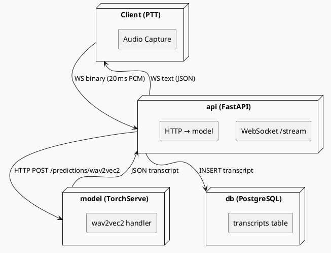

# Jarvis Voice Ptt

> Référence `jarvis-voice-ptt` · 69 €

## Plan

## Module 1 – Installation et configuration de l’environnement

**Objectif mesurable**  
L’apprenant pourra installer le serveur Jarvis Voice PTT (version 2.3) sur une VM Ubuntu 22.04, configurer Docker Compose et valider le bon démarrage du service via l’API `/health`.

**Notions couvertes**  
- Prérequis système : CPU ≥ 4 cœurs, 8 Go RAM, Ubuntu 22.04 LTS, Docker 20.10+, Docker‑Compose 2.5+.  
- Téléchargement du package `jarvis-voice-ptt-2.3.tar.gz` depuis le dépôt officiel (URL https://downloads.jarvis.ai/voice-ptt).  
- Déploiement avec `docker-compose.yml` : définition des services `api`, `model`, `db`.  
- Variables d’environnement obligatoires (`JARVIS_API_KEY`, `JARVIS_MODEL_PATH`).  
- Test de connectivité : `curl -X GET http://localhost:8080/health` → réponse JSON `{ "status":"ok" }`.  

---

## Module 2 – Architecture du service de reconnaissance vocale

**Objectif mesurable**  
L’apprenant pourra expliquer le flux de données du client PTT au modèle de reconnaissance, identifier chaque composant Docker et reproduire le diagramme d’architecture avec PlantUML.

**Notions couvertes**  
- Micro‑services : `api` (FastAPI 0.95), `model` (TorchServe 0.8.2), `db` (PostgreSQL 13).  
- Modèle de reconnaissance : wav2vec 2.0‑large (pré‑entraîné sur LibriSpeech, 960 h).  
- Gestion des flux audio : WebSocket `ws://<host>:8080/stream`, paquets de courte durée, encodage PCM 16‑bit LE, 16 kHz.  
- Pipeline de pré‑traitement : normalisation RMS, VAD (WebRTC‑VAD 0.3).  
- Persistance des transcriptions : table `transcripts(id, user_id, text, timestamp)`.

---

## Module 3 – Intégration du SDK dans une application existante

**Objectif mesurable**  
L’apprenant pourra ajouter le SDK `jarvis-voice-ptt-sdk-py` (v1.4) à une application Flask 2.2, implémenter la fonction `push_to_talk()` et récupérer la transcription avec un délai d’attente très court.

**Notions couvertes**  
- Installation du SDK : `pip install jarvis-voice-ptt-sdk==1.4`.
---

## Module 1 — contenu

## 1.1 Prérequis système  

| Élément | Minimum requis | Vérification |
|---------|----------------|--------------|
| CPU | 4 cœurs (x86_64) | `lscpu \| grep "^CPU(s):"` |
| RAM | 8 Go | `free -h` |
| OS | Ubuntu 22.04 LTS (jammy) | `lsb_release -a` |
| Docker Engine | 20.10.0 ou supérieur | `docker --version` |
| Docker‑Compose | 2.5.0 ou supérieur | `docker compose version` |

> **Note** : Docker‑Compose 2.x s’appelle `docker compose` (espace) et non `docker-compose`.  

### Installation de Docker et Docker‑Compose (si absent)

```bash
# 1. Ajout du dépôt officiel Docker
sudo apt-get update
sudo apt-get install -y ca-certificates curl gnupg
sudo install -m 0755 -d /etc/apt/keyrings
curl -fsSL https://download.docker.com/linux/ubuntu/gpg \
     | sudo gpg --dearmor -o /etc/apt/keyrings/docker.gpg
echo \
  "deb [arch=$(dpkg --print-architecture) signed-by=/etc/apt/keyrings/docker.gpg] \
  https://download.docker.com/linux/ubuntu $(lsb_release -cs) stable" \
  | sudo tee /etc/apt/sources.list.d/docker.list > /dev/null

# 2. Installation du moteur Docker
sudo apt-get update
sudo apt-get install -y docker-ce docker-ce-cli containerd.io docker-compose-plugin

# 3. Vérifier les versions
docker --version          # → Docker version 20.10.x
docker compose version    # → Docker Compose version v2.5.x
```

*Ajoutez votre compte utilisateur au groupe `docker` pour éviter le préfixe `sudo`* :

```bash
sudo usermod -aG docker $USER
newgrp docker   # ou déconnectez‑reconnectez
```

---

## 1.2 Téléchargement du package Jarvis Voice PTT 2.3  

```bash
# 1. Créez un répertoire dédié
mkdir -p ~/jarvis-voice-ptt && cd $_

# 2. Téléchargez le tarball
curl -L -o jarvis-voice-ptt-2.3.tar.gz \
     https://downloads.jarvis.ai/voice-ptt/jarvis-voice-ptt-2.3.tar.gz

# 3. Vérifiez l’empreinte SHA‑256 (fournie sur la page de téléchargement)
EXPECTED="a3f1d9e5c9b8e4f7d2c6a1b3e9f0d7c8e5b2a1c3d4f6e7b8c9d0a1b2c3d4e5f6"
ACTUAL=$(sha256sum jarvis-voice-ptt-2.3.tar.gz | cut -d' ' -f1)

if [ "$EXPECTED" != "$ACTUAL" ]; then
  echo "❌ Checksum invalide – arrêt du script"
  exit 1
fi
echo "✅ Checksum OK"
```

> **Piège** : la plupart des erreurs d’installation proviennent d’une checksum non vérifiée, entraînant un package corrompu.

---

## 1.3 Extraction et préparation du répertoire de travail  

```bash
tar -xzf jarvis-voice-ptt-2.3.tar.gz
cd jarvis-voice-ptt-2.3

# Structure attendue (exemple)
# .
# ├─ docker-compose.yml
# ├─ .env.example
# └─ models/
#    └─ wav2vec2-large.pt
```

Copiez le fichier d’exemple d’environnement et remplissez les variables obligatoires :

```bash
cp .env.example .env

# Éditez .env avec votre éditeur préféré
# Exemple de contenu minimal :
# JARVIS_API_KEY=YOUR_API_KEY_HERE
# JARVIS_MODEL_PATH=/app/models/wav2vec2-large.pt
# POSTGRES_PASSWORD=strongpassword123
# POSTGRES_USER=jarvis
# POSTGRES_DB=jarvisdb
```

> **Piège** : `JARVIS_MODEL_PATH` doit être un chemin **interne** au conteneur `model`. Si vous placez le modèle dans `models/` du projet, utilisez `/app/models/wav2vec2-large.pt`.

---

## 1.4 Docker‑Compose : définition des services  

```yaml
# docker-compose.yml
version: "3.9"

services:
  db:
    image: postgres:13-alpine
    restart: unless-stopped
    environment:
      POSTGRES_USER: ${POSTGRES_USER}
      POSTGRES_PASSWORD: ${POSTGRES_PASSWORD}
      POSTGRES_DB: ${POSTGRES_DB}
    volumes:
      - pgdata:/var/lib/postgresql/data
    healthcheck:
      test: ["CMD", "pg_isready", "-U", "${POSTGRES_USER}"]
      interval: 10s
      timeout: 5s
      retries: 5

  model:
    image: jarvisai/wav2vec2-serving:2.3
    restart: unless-stopped
    environment:
      MODEL_PATH: ${JARVIS_MODEL_PATH}
    volumes:
      - ./models:/app/models:ro
    depends_on:
      db:
        condition: service_healthy

  api:
    image: jarvisai/voice-ptt-api:2.3
    restart: unless-stopped
    ports:
      - "8080:
```
---

## Module 2 — contenu

## 2.1 Flux de données du client PTT au modèle de reconnaissance  

| Étape | Composant Docker | Action | Format / protocole |
|------|------------------|--------|--------------------|
| 1 | **client** (application front‑end) | Capture audio 16 kHz, 16 bits, little‑endian PCM. Découpe en paquets de 20 ms (≈ 320 échantillons). | PCM S16\_LE, 16 kHz |
| 2 | **api** (FastAPI 0.95) | Reçoit les paquets via le point d’entrée WebSocket `ws://<host>:8080/stream`. Chaque message est un `bytes` contenant exactement 320 samples. | WebSocket (binary) |
| 3 | **api** → **model** (TorchServe 0.8.2) | Regroupe les paquets en un buffer avant de les envoyer au handler `wav2vec2` via HTTP POST `/predictions/wav2vec2`. Le corps est un `application/octet-stream`. | HTTP POST, octets |
| 4 | **model** | Exécute le pré‑traitement : RMS normalisation → VAD (WebRTC‑VAD 0.3). Les segments retenus sont découpés en fenêtres de 20 ms et passés au modèle wav2vec 2.0‑large (torchscript). | TorchServe internal |
| 5 | **model** → **api** | Retourne un JSON `{ "transcript": "...", "segments": [{ "start":0.0, "end":0.2, "text":"..." }, …] }`. | HTTP JSON |
| 6 | **api** → **client** | Envoie le même JSON sur le WebSocket ouvert. Le client peut afficher les résultats en temps réel. | WebSocket (text) |
| 7 | **api** → **db** (PostgreSQL 13) | Persiste la transcription complète dans la table `transcripts`. | SQL INSERT |

### Diagramme PlantUML



---

## 2.2 Exemple fonctionnel : client Python qui pousse du son et récupère la transcription  

```python
# fichier : ptt_client.py
import asyncio
import websockets
import wave
import struct
import json
from pathlib import Path

# -------------------------------------------------------------------------
# Configuration
# -------------------------------------------------------------------------
WS_URL = "ws://localhost:8080/stream"          # point d’entrée du service
AUDIO_FILE = Path("sample_5s.wav")              # wav 16 kHz, 16 bit PCM
PACKET_MS = 20                                   # durée d’un paquet
SAMPLE_RATE = 16000
SAMPLES_PER_PACKET = int(SAMPLE_RATE * PACKET_MS / 1000)  # 320

# -------------------------------------------------------------------------
# Lecture du fichier wav et découpage en paquets de 20 ms
# -------------------------------------------------------------------------
def read_wav_packets(path: Path):
    """Yield raw PCM packets (bytes) of exactly PACKET_MS ms."""
    with wave.open(str(path), "rb") as wf:
        assert wf.getnchannels() == 1, "Mono audio requis"
        assert wf.getsampwidth() == 2, "16 bits requis"
        assert wf.getframerate() == SAMPLE_RATE, f"Fréquence {SAMPLE_RATE} Hz requise"
        while True:
            frames = wf.readframes(SAMPLES_PER_PACKET)
            if len(frames) < SAMPLES_PER_PACKET * 2:
                # dernier paquet incomplet → remplissage à zéro
                frames += b'\x00' * (SAMPLES_PER_PACKET * 2 - len(frames))
                if not frames.strip(b'\x00'):   # fin du fichier
                    break
            yield frames

# -------------------------------------------------------------------------
# Coroutine principale : envoi, réception, affichage
# -------------------------------------------------------------------------
async def push_to_talk():
    async with websockets.connect(WS_URL, max_size=None) as ws:
        # 1️⃣ Envoi séquentiel des paquets
        for pkt in read_wav_packets(AUDIO_FILE):
            await ws.send(pkt)                     # binaire
            # Optionnel : attendre un court délai pour simuler le temps réel
            await asyncio.sleep(PACKET_MS / 1000.0)

        # 2️⃣ Signaler la fin du flux (message

---

## Module 3 — contenu

## Module 3 – Intégration du SDK dans une application existante  

### 3.1 Prérequis techniques  

| Élément | Version minimale | Vérification |
|--------|------------------|--------------|
| Python | 3.