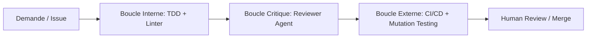

## Q15 — Comment mesurer et améliorer objectivement la qualité du travail produit par Claude Code sur la durée : métriques, garde-fous, boucles de feedback ?

Pour mesurer et améliorer objectivement la qualité du travail produit par **Claude Code** (et les agents de codage autonomes) sur la durée, l'état de l'art (2025–2026) s'articule autour de l'**ingénierie du harnais (*Harness Engineering*)** et de l'**Eval-Driven Development (EDD)**. 

L'approche repose sur trois piliers : métriques de flux/résultat, garde-fous structurels et boucles de vérification déterministes.

---

### 1. Métriques Objectives : Mesurer l'Impact et la Dérive

Ne mesurez pas le volume brut (lignes de code, suggestions acceptées) qui favorise le "code bloat", mais concentrez-vous sur des métriques de résultat et de fiabilité :

#### A. Métriques de Résolution & Fiabilité
* **Task Completion Rate (TCR) :** Pourcentage de tâches/tickets résolus sans intervention manuelle corrective (`Pass@1` et `Pass@3`).
* **Code Churn / Rework Rate à J+14 :** Pourcentage de code généré par l'agent qui est réécrit ou supprimé dans les 14 jours suivant la fusion (détecte la dette technique masquée).
* **Test Degradation Index (Anti-Gaming) :** Surveillance automatique des tests modifiés par l'agent. Un agent a tendance à relaxer ou supprimer des assertions pour faire passer son code ; le ratio de tests altérés/supprimés doit être strictement mesuré.

#### B. Métriques de Qualité Structurelle
* **Delta de Couverture et Qualité de Mutation :**
  * $\Delta$ Code Coverage sur le diff.
  * **Mutation Score** (via *mutmut* ou *Stryker*) : s'assurer que les tests écrits par l'agent capturent réellement des régressions et ne testent pas des stubs vides.
* **Complexité Cyclomatique & Maintainability Index :** Écart de complexité introduit par rapport à la moyenne du dépôt (analyse statique Sonar / Ruff / ESLint).

#### C. Métriques d'Efficience Opérationnelle
* **Token-to-PR Ratio & Longueur de Contexte :** Nombre de tokens consommés par tâche réussie. Une explosion de la consommation indique un agent qui tourne en boucle ou s'égare dans son contexte.
* **Iteration Count :** Nombre de tours de boucle (commandes/tests) exécutés par tâche avant d'atteindre un état stable.

---

### 2. Garde-Fous (*Guardrails*) : Contraindre l'Espace d'Erreur

L'agent ne doit jamais avoir une liberté totale sans barrières architecturales explicites.

#### A. Pilotage déterministe via `CLAUDE.md` hiérarchisé
* **Règles impératives et concises (50 à 200 lignes max) :** Utilisez des verbes d'action stricts (`"Exécute 'npm run typecheck' avant chaque commit"`, `"Strict TypeScript activé"`). Évitez le texte narratif inutile qui dilue la fenêtre de contexte.
* **Zones sanctuarisées (*Protected Paths*) :** Interdire explicitement l'édition directe des dossiers sensibles (`/auth`, `/infra`, migrations de bases, CI workflows) sans validation explicite.
* **Hiérarchie de contexte :** Déployer un `CLAUDE.md` global d'organisation + des fichiers `CLAUDE.md` locaux par microservice/dossier.

#### B. Mode "Plan-First" et Sandboxing
* **Planification obligatoire :** Forcer l'agent à produire un artifact de plan (fichiers impactés, stratégie de test, contrat d'API) avant d'autoriser la phase d'édition.
* **Isolation d'exécution :** Exécuter les commandes dans un conteneur éphémère / sandbox avec un principe de moindre privilège (interdiction d'élévation `sudo`, réseau restreint, pas d'accès aux secrets de production).

#### C. CI Out-of-Band (Garde-fou inviolable)
* La validation finale ne doit **jamais** dépendre du reporting interne de l'agent. Les GitHub Actions / pipelines CI doivent tourner dans un environnement externe scellé où l'agent ne peut pas altérer la configuration du runner ou des linters.

---

### 3. Boucles de Feedback : L'Ingénierie de la Vérification

Pour fiabiliser la production sur la durée, installez trois niveaux de boucles de rétroaction :

#### A. Boucle Interne (Vérification autonome & TDD)
* **Test-Driven Generation :** Forcer Claude Code à écrire ou vérifier le test unitaire échoué (*Red*) avant d'implémenter le correctif (*Green*).
* **Commandes de vérification standardisées :** Intégrer des scripts d'autovérification (`/verify` ou scripts pre-commit) exécutant en un bloc : compilation/typecheck + linter strict + suite de tests unitaires rapides.

#### B. Boucle Critique Multi-Agents (*Review Loop*)
* Utiliser un **agent de revue indépendant** (contexte vierge) après l'achèvement de la tâche par l'agent principal.
* Cet agent inspecte uniquement le `git diff` avec une grille d'évaluation stricte : respect des conventions, détection d'effets de bord, failles de sécurité OWASP, clarté des commentaires et dérive architecturale.

#### C. Boucle d'Évaluation Continue (*Eval Harness* / Golden Dataset)
* **Harnais d'évaluation interne (inspiré de SWE-bench) :** Construire un corpus interne de 20 à 50 bugs et features représentatifs du dépôt (avec tests unitaires d'acceptation figés).
* **Test de non-régression de l'agent :** Exécuter ce benchmark automatiquement lors des montées de version du modèle, des modifications du `CLAUDE.md` ou de l'ajout de nouveaux outils/skills pour mesurer l'impact direct sur la performance.

---

### Plan d'Action Recommandé

| Étape | Action concrète | Outils / Fichiers |
|---|---|---|
| **1. Socle** | Créer un `CLAUDE.md` impératif (< 150 lignes) avec chemins interdits et commande unique de test. | `.github/CLAUDE.md` |
| **2. Portails** | Ajouter pre-commit hooks + CI bloquante sur le typage strict et la couverture. | Husky, Ruff, ESLint, Vitest, pytest |
| **3. Boucle** | Instancier une commande `/verify` locale réutilisable par l'agent avant tout commit. | `scripts/verify.sh` |
| **4. Mesure** | Suivre le taux de PR révisées et le rework rate sur 14 jours. | Télémétrie Git / CI |
| **5. Evals** | Créer 10 cas de test golden dans un runner de bench local. | Harness YAML / Pytest eval suite |

---

### Sources & Références (2025–2026)
1. **Martin Fowler / ThoughtWorks (2025–2026)** : *Harness Engineering & Defense-in-Depth for Agentic Coding*.
2. **Anthropic Engineering & Documentation (2025–2026)** : *Claude Code Guide, Best Practices for CLAUDE.md & Subagent Architectures*.
3. **SWE-bench & MorphLLM Research (2026)** : *Evaluating Code Agents: Moving beyond raw reasoning to environment harness quality*.
4. **Axify & LeadDev Insights (2025–2026)** : *Measuring AI Engineering Productivity: Why Code Churn and PR Review Effort Matter over Lines of Code*.
5. **Open Source Community (2026)** : `claude-code-harness` & *Eval-Driven Development (EDD) patterns*.

