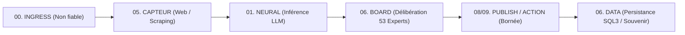
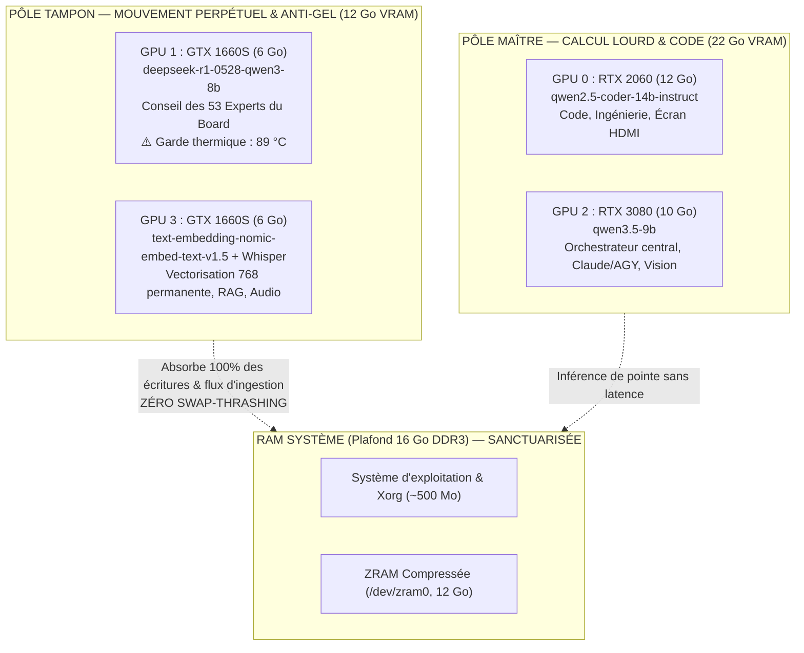

# 🧬 MANUEL SOUVERAIN — BIOS BOYAU & LES 9 COUCHES SYSTÈME JARVIS OS
**Machine Hôte** : M6 (`turbo` / `jarvis-franck-m6`) — Ubuntu 24.04 LTS  
**Gravure** : 19 août 2026  
**Statut** : 🔒 **Mode d'utilisation permanent & Invariant gravé à jamais**

---

## 1. 🏛️ LA DOCTRINE DU BIOS BOYAU : LES 4 LOIS FRONTIÈRES

Le **BIOS Boyau** impose une stricte rupture de privilège et une linéarité absolue des flux opérationnels :



### Les 4 Lois Frontières Inviolables :
1. **Loi A1 (Gateway LLM Unique)** : Tout appel d'inférence passe exclusivement par la passerelle `Neural` (`127.0.0.1:1234` / `claude-m6`). Le nœud LLM est une feuille acyclique (ne rappelle personne).
2. **Loi A2 (Mémoire Durable Unique)** : Toute persistance pérenne s'effectue via la couche `DATA` (`jarvis_master.db`, `etoile.db`, `board.db`, `memory_atoms`).
3. **Loi A3 (Acquisition Web Unique)** : Tout flux externe HTTP passe par `WEB` (BrowserOS MCP / Playwright) avec blocage SSRF strict (`127.0.0.1`, RFC 1918, cloud metadata).
4. **Loi A4 (Sortie & Action Contrôlée)** : Aucun effet de bord direct sans validation de schéma typé et d'autorité locale bornée (A5).

---

## 2. 🧱 LA MATRICE DES 9 COUCHES SYSTÈME (00 À 09)

| Couche | Nom | Hardware / Support | Rôle & Valise Opérationnelle | Invariant de Sécurité |
|---|---|---|---|---|
| **00** | **BIOS / HOLDING** | CPU / RAM centrale | **Orchestrateur & Décision** : DAG, consensus, ordonnancement maître. | A0 (Ingress non fiable), A5 (Autorité bornée). |
| **01** | **NEURAL** | Quad-GPU CUDA 13 | **Inférence LLM Souveraine** : LM Studio 1234, continuous batching (PARALLEL=4), 0 token payant. | A1 (Gateway unique, acyclique). |
| **02** | **VOICE** | GPU 3 (GTX 1660S) | **Audition & Parole** : Whisper STT :9743, Piper TTS, Lumen context watcher. | Inférence audio isolée en VRAM dédiée. |
| **03** | **COMMS** | Network / Async | **Messagerie & Alertes** : Routeur 4 bots Telegram, alertes cluster, passerelle événementielle. | Validation stricte des webhooks entrants. |
| **04** | **CONTENT** | Local PIL / CPU | **Production Créative (Mirra)** : Génération carrousels, formats courts, social autopilot. | Rendu local sans API cloud payante. |
| **05** | **WEB / BROWSER** | CDP :9108/:9222 | **Capteurs & Automatisation Web** : BrowserOS MCP :9201, Playwright, scraping. | A3 (Blocage SSRF, sandbox browser). |
| **06** | **DATA / SOUVENIR** | NVMe / SQLite / Notion | **Mémoire & Bibliothèque Vivante** : `jarvis_master.db`, `etoile.db`, `board.db` (250k chunks), Sync Notion. | A2 (Mémoire durable unique, ACID). |
| **07** | **OPS / SRE** | ZRAM 12G / limits.d | **Résilience & Anti-Gel** : Autoheal, memlock unlimited, garde thermique 89 °C, anti-swap-thrash. | Zéro gel OS, isolation thermique. |
| **08** | **BUSINESS** | Apps :5000/:8080 | **Monétisation & Métier** : Benchmark freelance, facturation CERFA, CRM. | Audit comptable et traçabilité. |
| **09** | **HMI / DESKTOP** | GPU 0 HDMI / TMUX | **Cockpit & Présentation** : Table Ronde TMUX, HUD Conky, PWA :8088, Turbo Dashboard :8080. | Interface temps réel souveraine. |

---

## 3. 🎮 TOPOLOGIE QUAD-GPU & BUFFER ANTI-FREEZE (34,5 Go VRAM)



---

## 4. 🚀 MODE D'UTILISATION PERMANENT & COMMANDES ESSENTIELLES

### A. Lancer Claude Code sur les modèles locaux (0 token payant)
```bash
# Inférence locale sur Qwen 2.5 Coder 14B (GPU 0) avec cascade M6 ➔ M4 :
claude-m6 --model qwen2.5-coder-14b-instruct

# Inférence locale sur l'orchestrateur Qwen 3.5 9B (GPU 2) :
claude-m6 --model qwen/qwen3.5-9b
```

### B. Interroger le Conseil des 53 Experts du Board (GPU 1 + GPU 3)
```bash
# Interrogation souveraine avec citations obligatoires du corpus :
python3 ~/jarvis/board/board.py ask lmstudio-bionic "<votre_question>"
```

### C. Lancer le Cockpit de Contrôle (Table Ronde TMUX)
```bash
/home/turbo/Bureau/SCRIPTS_OPTIMISATION_SYSTEME/LANCER_TABLE_RONDE_TMUX.sh
tmux attach -t TABLE_RONDE_M6
```

### D. Synchronisation & Mémoire SQLite
- **Master SQLite** : `/home/turbo/jarvis/jarvis_master.db`
- **Audit & Invariants** : `/home/turbo/jarvis/data/etoile.db`
- **Board Souverain** : `/home/turbo/jarvis/board/board.db`
- **Bibliothèque de Compétences** : `/home/turbo/Workspaces/jarvis-linux/skills-library/skills_library.db`

