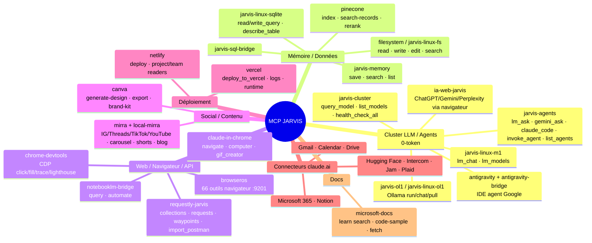

# 🧠 Carte mentale MCP — écosystème JARVIS (2026-07-16)

Serveurs MCP réellement connectés à la session (la liste `.claude.json` locale n'en déclare que 4 ; les autres viennent des plugins/config projet).

## Lecture rapide par usage (LOI #2 — déléguer 0-token)
| Besoin | Serveur MCP prioritaire |
|---|---|
| Inférence LLM locale gratuite | `jarvis-agents.lm_ask` / `jarvis-cluster.query_model` / `jarvis-linux-m1.lm_chat` |
| Mémoire persistante | `jarvis-memory` |
| Requête SQL | `jarvis-linux-sqlite` / `jarvis-sql-bridge` |
| Test/rejouer une API HTTP | **`requestly-jarvis`** (collections, waypoints, import Postman) |
| Navigateur/scrape/formulaire | `browseros` (:9201) → `chrome-devtools` → `claude-in-chrome` |
| Publication sociale | `mirra` (+ LinkedIn via CDP hors OAuth) |
| Déploiement site | `netlify` / `vercel` |
| Recherche vectorielle | `pinecone` |

> **requestly-jarvis** = banc d'essai HTTP : `add_collection` → `add_request` → `execute_request` / `execute_waypoint`, import Postman. Idéal pour valider/rejouer les endpoints du hub :18800, du cluster LLM, ou des webhooks n8n de façon reproductible.
