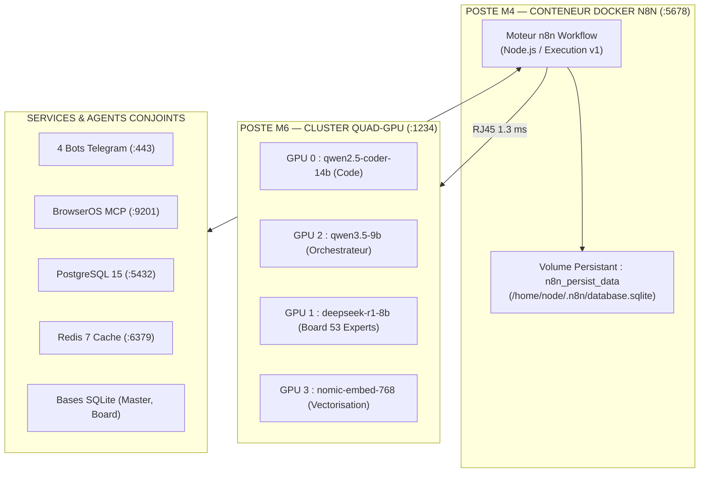

# ⚡ STRATÉGIE DES FLUX N8N EN CONTENEUR DOCKER — CLUSTER SOUVERAIN M6/M4
**Machine Hôte** : M4 (`pamerys-m4`) Docker Swarm & M6 (`turbo`)  
**Port** : `5678` (`http://10.42.0.1:5678` / `http://127.0.0.1:5678`)  
**Version** : v2.0 — Architecture 0-Token & Routage Quad-GPU M6  
**Date** : 19 août 2026

---

## 1. 🏗️ ARCHITECTURE DU CONTENEUR DOCKER N8N & PERSISTANCE



### Invariants Docker :
- **Mode Réseau** : `network_mode: host` ou `jarvis_net` pour joindre sans latence `10.42.0.230:1234` (M6).
- **Persistance** : Montage strict de `/home/node/.n8n` vers le volume `n8n_persist_data` (anti-perte de workflows).
- **Sécurité** : `N8N_ENCRYPTION_KEY` et tokens protégés dans le coffre `secrets.env`.

---

## 2. 🌊 LES 5 FLUX STRATÉGIQUES MAÎTRES

### Flux 1 · Routeur LLM Quad-GPU Intelligent (`/webhook/llm-ask`)
- **Déclencheur** : Webhook entrant (POST).
- **Logique de Routage** :
  - Intention = `code`, `refactor`, `sql` ➔ **GPU 0** (`qwen2.5-coder-14b-instruct`).
  - Intention = `reasoning`, `analyse`, `decision` ➔ **GPU 2** (`qwen/qwen3.5-9b`).
  - Intention = `board_debate`, `expert_vote` ➔ **GPU 1** (`deepseek-r1-0528-qwen3-8b`).
  - Intention = `embedding`, `similarity` ➔ **GPU 3** (`text-embedding-nomic-embed-text-v1.5`).
- **Résilience** : En cas d'échec M6 (timeout > 5s), bascule automatique sur Ollama M4 (`127.0.0.1:11434`).

### Flux 2 · Moteur de Veille & Production Sociale (Mirra Autopilot)
- **Déclencheur** : Schedule Cron (Matin 08h30 / Midi 12h30 / Soir 18h30).
- **Pipeline** :
  1. Extraction des tendances via BrowserOS MCP (`:9201`) et flux RSS.
  2. Vectorisation & RAG sur GPU 3 (`nomic-embed`).
  3. Rédaction du post & titre accrocheur sur GPU 2 (`qwen3.5-9b`).
  4. Génération de carrousel ou bannière via script PIL local.
  5. Notification Telegram avec boutons `[Approuver]` / `[Rejeter]`.
  6. Si approuvé ➔ Publication automatique API LinkedIn / X.

### Flux 3 · Ingestion Perpétuelle & Synchronisation Board
- **Déclencheur** : Webhook GitHub ou Watcher de fichier local.
- **Pipeline** :
  1. Découpage du document en chunks de 500-1000 tokens.
  2. Appel batch `/v1/embeddings` sur GPU 3 de M6.
  3. Insertion directe dans `board.db` (tables `chunks` + `chunks_fts`).

### Flux 4 · Passerelle Messagerie & 4 Bots Telegram
- **Déclencheur** : Webhooks Telegram.
- **Pipeline** :
  1. Validation de l'ID utilisateur (protection contre les accès non autorisés).
  2. Routage vers la commande système ou l'agent dédié.
  3. Réponse instantanée en markdown.

### Flux 5 · SRE Watchdog & Supervision Thermique
- **Déclencheur** : Intervalle de 5 minutes.
- **Pipeline** :
  1. Sondage santé `/v1/models` sur M6.
  2. Lecture température GPU (`nvidia-smi`).
  3. Si GPU 1 > 85 °C ➔ Mise en pause temporaire des tâches de fond.
  4. Si service inactif ➔ Déclenchement de `systemctl --user restart lmstudio.service`.

---

## 3. 🚀 FICHIER DOCKER-COMPOSE SOUVERAIN (N8N)

```yaml
version: '3.8'

services:
  n8n:
    image: docker.n8n.io/n8nio/n8n:latest
    container_name: jarvis_n8n
    restart: unless-stopped
    network_mode: host
    environment:
      - N8N_HOST=0.0.0.0
      - N8N_PORT=5678
      - N8N_PROTOCOL=http
      - NODE_ENV=production
      - WEBHOOK_URL=http://10.42.0.1:5678/
      - GENERIC_TIMEZONE=Europe/Paris
      - TZ=Europe/Paris
      - N8N_DEFAULT_BINARY_DATA_MODE=filesystem
      - EXECUTIONS_DATA_PRUNE=true
      - EXECUTIONS_DATA_MAX_AGE=168
      - LMSTUDIO_M6_URL=http://10.42.0.230:1234
    volumes:
      - n8n_persist_data:/home/node/.n8n
      - /home/pamerys/jarvis:/home/node/jarvis:ro
      - /tmp:/tmp

volumes:
  n8n_persist_data:
    external: true
```

