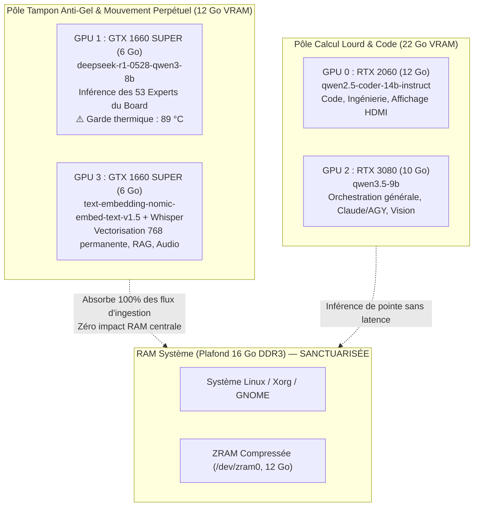

# Fiche 29 — Stratégie Quad-GPU Souveraine : Tampon Anti-Gel, Board & Bibliothèque Vivante

*Document de référence stratégique et de paramétrage matériel pour M6 (`turbo`).*
*Compilé le 19 août 2026.*

---

## 1. 🎯 Le Défi Matériel de M6 : Plafond RAM 16 Go vs Multi-Agents

La machine centrale M6 dispose de **15 GiB de RAM physique utile** (plafond matériel DDR3).
Lorsque de multiples agents autonomes (Claude Code, OpenClaw, Board, Ingestion 24/7) opèrent simultanément, les requêtes lourdes risquent de saturer la RAM système, poussant le noyau Linux dans un cycle de **swap-thrashing** (écritures massives sur SSD/ZRAM) qui provoque le **gel complet (freeze) de l'OS**.

---

## 2. 🛡️ La Solution Architecturale : Tampon VRAM & Mouvement Perpétuel

Pour sanctuariser la RAM centrale et éliminer tout risque de gel, les **34,5 Go de VRAM** des 4 GPU Nvidia sont rigoureusement segmentés :

---

## 3. 📊 Matrice d'Affectation & Paramétrage Strict LM Studio

| GPU | Carte | VRAM | Modèle Assigné | Rôle Opérationnel | Configuration LM Studio |
|---|---|---|---|---|---|
| **GPU 0** | **RTX 2060** | 12 Go | `qwen2.5-coder-14b-instruct` | Ingénierie logicielle, refactoring, CLI `ask-coder`, affichage HDMI. | `mainGpu: 0`, `disabledGpus: [1, 2, 3]`, `tensorSplit: [1, 0, 0, 0]`, `ctx: 32k/64k` |
| **GPU 2** | **RTX 3080** | 10 Go | `qwen3.5-9b` | Orchestrateur central, raisonnement, veille, agents Claude/AGY. | `mainGpu: 2`, `disabledGpus: [0, 1, 3]`, `tensorSplit: [0, 0, 1, 0]`, `ctx: 32k/64k` |
| **GPU 1** | **GTX 1660S** | 6 Go | `deepseek-r1-0528-qwen3-8b` | **Board & Conseil des 53 Experts** : délibérations souveraines avec citations. | `mainGpu: 1`, `disabledGpus: [0, 2, 3]`, `tensorSplit: [0, 1, 0, 0]`, `ctx: 16k` |
| **GPU 3** | **GTX 1660S** | 6 Go | `text-embedding-nomic-embed-text-v1.5` | **Moteur Perpétuel & RAG** : vectorisation continue 768-dim, transcription Whisper. | `mainGpu: 3`, `disabledGpus: [0, 1, 2]`, `tensorSplit: [0, 0, 0, 1]`, `ctx: 2048` |

---

## 4. ⚡ Principes d'Ingénierie Clés

1. **Isolation Totale des Bus PCIe** :
   Chaque modèle est confiné sur sa carte dédiée (`tensorSplit` exclusif). Zéro communication inter-GPU PCIe x1 inutile.
2. **Quantification KV-Cache & Flash Attention** :
   - `kCacheQuantizationType: q8_0`
   - `vCacheQuantizationType: q8_0`
   - `flashAttention: true`
   - Permet d'allouer 4 prédictions concurrentes (`PARALLEL = 4`) sans dépasser la VRAM physique.
3. **Mémoire Verrouillée (`memlock`)** :
   - `/etc/security/limits.d/99-lmstudio-memlock.conf` positionné à `unlimited`.
   - `useMlock: false` / `useMmap: true` configurés par défaut pour garantir la fluidité I/O sans panique noyau.
4. **Sécurité Thermique Active** :
   - GPU 1 est monitoré avec un seuil d'arrêt strict à **89 °C** dans `board.py` pour préserver le matériel sous charge d'ingestion massive.

