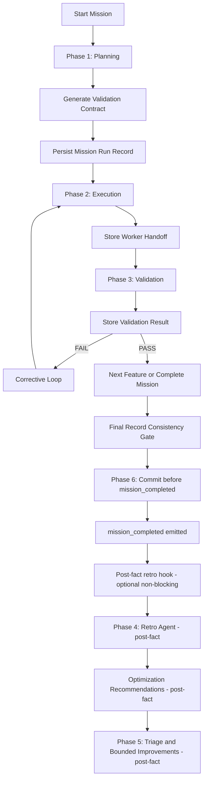

# Multi-Agent Mission Execution Runbook

Use this skill to start or continue a mission loop that needs planned sequencing, isolated implementation, adversarial verification, and measurable retrospective optimization.

## Canonical Contracts
- Architect Planner produces the [Validation Contract](../../prompts/validation-contract.prompt.md).
- Worker Software Engineer produces the [Worker Handoff](../../prompts/worker-handoff.prompt.md).
- Adversarial Validator produces the [Validation Result](../../prompts/validation-result.prompt.md).
- Architect Planner maintains the [Mission Run Record](../../prompts/mission-run-record.prompt.md) under `.github/mission-runs/<run-id>/`.
- Retro Agent reviews completed Mission Run Records to optimize token usage, tool usage, latency, and retry loops.
- Change Committer stages and commits only the validated in-scope files; the commit happens before `mission_completed` is emitted, after the Final Record Consistency Gate passes. Retro, triage, and bounded improvements are post-fact activities and do not block the commit.

## The Mission Loop Overview
Missions run in four sequential phases:

---

## Detailed Procedures

### Phase 1: Planning
1. Invoke `Architect Planner` with the user's objective.
2. Require a Validation Contract with strictly sequential features and exactly one rule per feature.
3. Create or update a Mission Run Record under `.github/mission-runs/<run-id>/` and store the Validation Contract as `artifacts/validation-contract.md`.

### Phase 2: Execution
1. For the active feature only, invoke `Worker Software Engineer` with that feature and rule.
2. Require a Worker Handoff listing modified files, proposed commands, risks, and next steps.
3. Store the Worker Handoff as `artifacts/feature-<NN>-worker-handoff-attempt-<NN>.md` and append an event to `events.jsonl`.
4. Instruct the Worker to batch known independent file reads into one turn and to batch independent multi-file edits into one turn, rather than issuing sequential single-file tool calls.
5. When the Worker's changes include custom shell helpers, lock logic, parsers, or similar deterministic utilities, require the Worker to include focused local verification commands — such as fixture invocations, dry-run executions, or parser checks against known inputs — in the Worker Handoff's "Proposed Commands to Run" section before validator handoff. Broad test-suite commands alone are not sufficient for these cases.

### Phase 3: Verification
1. Invoke `Adversarial Validator` with the Worker Handoff and the active feature's authoritative rule.
2. When the Worker Handoff includes Worker-proposed focused local verification commands, require the Adversarial Validator to execute those focused-check commands in addition to the authoritative contract rule. The Validator must record each focused-check result in the `[FOCUSED-CHECK EVIDENCE]` section of the Validation Result. Executing the authoritative rule alone is not sufficient when Worker-proposed focused-check commands are present.
3. Require a Validation Result with a binary `PASS` or `FAIL`.
4. Store the Validation Result as `artifacts/feature-<NN>-validation-result-attempt-<NN>.md` and append an event to `events.jsonl`.
5. On `PASS`, continue to the next feature or complete the mission. On `FAIL`, send `[CORRECTIVE ACTION]` back to the Worker and repeat Phase 2 for the same feature.

### Phase 4: Post-Fact Retrospective
1. **Run Retro Agent post-fact**: After `mission_completed` is emitted and the commit is recorded, invoke `Retro Agent` with the mission run id or `.github/mission-runs/<run-id>/` path. This phase is strongly recommended but does not block the commit or `mission_completed`.
2. Require a Retro Report focused on token efficiency, tool efficiency, latency, retry loops, and telemetry quality.
3. **Recommendation Triage**: Review all Retro Report recommendations and classify each as `apply-now`, `defer`, or `reject`. Select only the best bounded set of improvements to apply — improvements that are small in scope, high in impact, and do not require a full new mission to implement in isolation.
4. Use triaged `apply-now` recommendations to update future prompts, agents, skills, validation rules, or mission storage fields.
5. **Developer decides next steps**: After triage, the developer decides whether to apply recommendations as a separate follow-up mission or commit. Do not initiate improvement missions automatically.

### Final Record Consistency Gate
1. Before invoking Change Committer, verify record completeness.
2. Confirm that manifest artifact paths exist for every artifact path listed in `manifest.json`.
3. Confirm required `events.jsonl` events are present: at minimum `mission_started`, `contract_created`, and a `feature_passed` event for every feature in the contract. Do not require `mission_completed` or `mission_paused` at this gate — those events are recorded after the commit.
4. Confirm authoritative rule validation evidence exists for every feature (a recorded PASS Validation Result referencing the exact contract rule).
5. Confirm that commit evidence can be recorded by Change Committer (i.e., no gate requires mission_completed before Phase 6 Commit).
6. Do not advance to Phase 6 until all checks pass. Resolve any gap before proceeding.
7. Run `node .github/scripts/validate-mission-run-record.js .github/mission-runs/<run-id>` as a read-only mission-record validation check to verify layout, JSON/JSONL syntax, and passed-state invariants. A non-zero exit indicates a structural gap that must be resolved before proceeding.

### Phase 6: Commit
The lifecycle rule is: commit before mission_completed.

1. After the Final Record Consistency Gate passes, invoke `Change Committer` to commit before `mission_completed` is emitted. The commit must happen before mission_completed; retro, recommendation triage, and bounded improvements are post-fact activities and do not block this step.
2. Provide `Change Committer` with:
   - The explicit list of validated in-scope file paths.
   - A clear commit message in imperative mood (≤72 char subject line, optional body).
3. `Change Committer` will inspect `git status --short`, stage only the provided paths with `git add -- <paths>`, commit, and report the commit hash plus the final `git status --short`.
4. Do not commit before this phase. Do not bypass `Change Committer` by committing directly from another agent.
5. After `Change Committer` reports a successful commit, the Architect Planner **must** perform closure bookkeeping before emitting `mission_completed`:
   a. Update the Mission Run Record with commit evidence: record the commit hash, commit timestamp, and the final `git status --short` output reported by Change Committer.
   b. Append a `commit_recorded` event to `events.jsonl` containing the commit hash and timestamp. This event must be written before `mission_completed` is emitted.
   c. Only after both the commit evidence and the `commit_recorded` event are durably recorded, emit `mission_completed` and optionally trigger the post-fact retro hook.
6. A mission **must not** be described as passed or finalized until both the commit evidence and the `mission_completed` event are present in the Mission Run Record. Emitting `mission_completed` without first completing step 5a–5b is a protocol violation.
7. If the repository is already clean and a matching commit already exists (e.g., the commit was made in a prior interrupted run), the Architect Planner **must not** silently skip closure bookkeeping. Instead, reconcile the Mission Run Record explicitly: verify that the existing commit hash matches the expected scope, write or confirm commit evidence in the record, and append the `commit_recorded` event if it is absent, before proceeding to emit `mission_completed`.

### Post-Commit Passed-State Closure Gate
Before a mission may be marked `passed` or finalized, the Architect Planner must verify all four of the following conditions are durably satisfied. This is the post-commit passed-state closure gate — it runs after Phase 6 (Commit) and before the mission status is set to `passed`.

1. **Resolved commit evidence**: the Mission Run Record contains the commit hash, commit timestamp, and `git status --short` output reported by Change Committer.
2. **`commit_recorded` event**: `events.jsonl` contains a `commit_recorded` event with the commit hash and timestamp, appended before `mission_completed` was emitted.
3. **`mission_completed` event confirming final closure**: `events.jsonl` contains a `mission_completed` event recorded only after conditions 1 and 2 were confirmed durably in the record.
4. **Non-empty telemetry reference file**: `telemetry/copilot-debug-log-refs.jsonl` must be non-empty telemetry — it must contain at least one entry with a valid lookup reference (log path, timestamp range, or session/turn/request identifier). A completely empty file is not acceptable.

Do not mark the mission `passed` until all four conditions are met. Any unresolved condition must be remediated before mission status is updated to `passed`.

### Post-fact Retro Hook
After the commit and `mission_completed` is emitted, a batch retro may run as a non-blocking follow-up:
- Run `npm run retro:batch` (or `bash .github/hooks/run-retro-batch-copilot.sh` directly) to process
  all unretro'd terminal mission runs in a single consolidated Copilot session.
- The Stop hook (`post-mission-retro-copilot.json`) is kept in **manual-only** mode. Do not configure
  it for automatic invocation on session stop — doing so would re-enable automatic retro spawning and
  risk infinite retro loops.
- The batch script writes a Copilot prompt file to `.git/copilot-retro/` (or
  `${TMPDIR}/copilot-retro/` when no `.git` directory is present), keeping the post-commit working
  tree clean.
- The developer decides whether to apply retro recommendations as a separate follow-up mission or
  commit. The batch launcher can also be wired into a cron job or CI schedule trigger.

### Telemetry References
1. When Copilot debug JSONL logs are available, append lookup references to `telemetry/copilot-debug-log-refs.jsonl`.
2. Record log paths, timestamp ranges, session/turn/request identifiers when known, and lookup intent such as `tool_usage`, `token_usage`, `latency`, or `error_trace`.
3. Keep telemetry references separate from mission artifacts so a future retro agent can correlate mission events with tool usage and token usage without storing raw debug logs in the repository.
4. **Timestamps must be real wall-clock values.** Every `created_at` field in `manifest.json`, `events.jsonl`, and `telemetry/copilot-debug-log-refs.jsonl`, as well as every `updated_at` and `time_range` value, MUST reflect the actual wall-clock time at which that record is written or updated. Synthetic, placeholder, or sequence-derived timestamps — including literal strings such as `"ISO-8601 timestamp"`, `"TBD"`, or values mechanically derived from a sequence number — are explicitly forbidden.

### Hook Guidance
- Do not rely on hooks to invoke `Retro Agent`; hooks run deterministic shell commands, not model-driven analysis.
- Use hooks only as optional guardrails or post-fact helpers, such as validating that `manifest.json`, `events.jsonl`, and telemetry reference files exist, or writing a Copilot prompt for post-fact retro review.
- The post-fact retro batch launcher is the exception: running `npm run retro:batch` (or
  `bash .github/hooks/run-retro-batch-copilot.sh`) may optionally spawn Copilot CLI to prepare a
  retro prompt outside the repository, but it does not block the commit or `mission_completed`.
  The Stop hook (`post-mission-retro-copilot.json`) is kept in **manual-only** mode and must not be
  configured for automatic session-stop invocation.
- Keep any hook fast and storage-focused. If spawning Copilot CLI via a hook, write all output outside the repository working tree so the post-commit state remains clean. The actual retrospective reasoning should be a `Retro Agent` invocation so it can reason over mission artifacts and telemetry references.
