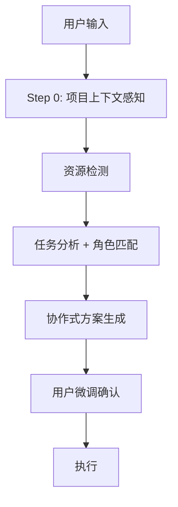

# MultiAgent Skill

## When to Use

Trigger when user:
- 显式调用 `/MultiAgent <任务描述>`
- 请求创建 Agent Teams / spawn teammates
- 使用关键词: "多 agent", "团队协作", "并行处理", "teammate"
- 任务需要多 Agent 并发执行

## Core Architecture



## Step 0: 项目上下文感知

在资源检测前，先了解项目背景，为 Agent 推荐和 prompt 注入提供基础。

**扫描策略（优先级递减）**:

1. **ONBOARDING.md**（如有）→ 提取工作类型分布、MCP 清单、团队 Tips
2. **CLAUDE.md** → 提取项目规范、代码风格、约束条件
3. **轻量扫描**（兜底）:
   - `git log --oneline -20` → 活跃领域/模块
   - `cat package.json` → 技术栈
   - `settings.json` → 已配置 MCP/Skills

**输出（注入到每个 Agent prompt）**:
```yaml
project_context:
  tech_stack: "如 Node.js/Express/TypeScript"
  active_areas: "如 支付模块、认证系统"
  code_style: "如 偏好函数式、禁止 any"
  key_files: "如 src/api/*, src/models/*"
  mcp_tools: "如 serena, playwright"
```

## Step 1: 资源检测

```yaml
检测来源:
  Agents: ~/.claude/plugins/*/agents/
  Plugins: settings.json → enabledPlugins
  Subagents: Agent tool 的 subagent_type 列表
  MCP: settings.json → mcpServers
```

## Step 2: 任务分析 + 角色匹配

统一的角色映射表（任务类型 → 角色 → subagent_type）:

| 任务类型 | 推荐角色 | subagent_type |
|----------|---------|---------------|
| 代码审查 | security-auditor, code-reviewer | `voltagent-qa-sec:security-auditor` |
| 功能开发(前端) | frontend-developer | `voltagent-core-dev:frontend-developer` |
| 功能开发(后端) | backend-developer | `voltagent-core-dev:backend-developer` |
| 全栈开发 | fullstack-developer | `voltagent-core-dev:backend-developer` |
| 数据库 | database-optimizer | `voltagent-data-ai:postgres-pro` |
| 测试 | test-automator | `voltagent-qa-sec:test-automator` |
| 安全 | security-auditor | `voltagent-qa-sec:security-auditor` |
| DevOps | devops-architect | `voltagent-dev-exp:build-engineer` |
| 文档 | technical-writer | `voltagent-dev-exp:documentation-engineer` |
| 研究 | research-analyst | `voltagent-research:research-analyst` |
| 数据 | data-analyst | `voltagent-data-ai:data-analyst` |
| 通用 | general-purpose | `general-purpose` |

> 注意: subagent_type 依赖已安装的 voltagent 插件。运行前用 `ls ~/.claude/plugins/*/agents/` 验证映射是否有效。

**复杂度判断**:

| 级别 | 条件 | 确认步骤 |
|------|------|---------|
| 简单 | <3 个队友、无依赖 | 仅确认队友 |
| 中等 | 3-5 个队友、有依赖 | 队友 + 文件 + 依赖 |
| 复杂 | >5 个队友、跨系统 | 队友 + 文件 + 依赖 + 隔离 + 验收标准 |

**动态工作流规模档位**（与 Claude Code 原生 `/config` 动态工作流规模对齐）:

> 以下为建议性指导（非强制限制）。用于在复杂度判断后，给出并发代理数量建议。

| 档位 | 并发代理数 | 适用 | 429 风险控制 |
|------|----------|------|-------------|
| `small` | 2-3 | 简单任务、单维度审查 | 无 |
| `medium` | 3-4（默认安全上限） | 中等任务、多维审查 | 默认安全 |
| `large` | 5-6（**必须分批**） | 复杂任务、跨系统 | 同消息并发 ≤ 4，超出分批启动；单 agent 失败自动重试 |

> **硬约束（实测固化）**: 同一条消息并发 agent ≤ 3-4 为安全上限；**6 个并发会触发 429 速率限制**（部分 agent 失败需单独重试救回）。`large` 档必须分批（每批 ≤ 4），并为每个 agent 准备 fallback（API Error / 超时 → 主 Agent 用 Bash/grep/Tavily 接管，不死等）。

## Step 3: 协作式方案生成

**核心理念**: 先输出完整方案草案，再请用户微调（而非逐项确认）。

```
流程:
  分析任务 → 直接输出完整方案（含队友/文件/依赖/执行步骤）
  → 用户审阅并指出需要调整的部分
  → 修改后确认
```

**方案输出格式**:

```markdown
# Agent Teams 方案: [任务名称]

## 任务概览
- 目标: [任务目标]
- 复杂度: [级别]
- 队友数量: [N]

## 队友配置
| 队友 | 角色 | subagent_type | 文件范围 | 依赖 |
|------|------|---------------|---------|------|

## 依赖图
[Mermaid graph showing dependencies]

## Agent Prompt 要点
每个 Agent 的 prompt 应包含:
  1. 具体任务描述
  2. 项目上下文摘要（Step 0 输出）
  3. 文件边界（可编辑/只读/禁止）
  4. 与其他 Agent 的接口约定
```

## Step 4: 评分检查

输出方案前做快速质量检查:

| 维度 | 权重 | 检查项 |
|------|------|--------|
| 任务清晰度 | 25% | 目标明确? 范围界定? |
| 角色匹配 | 25% | 角色匹配任务? 资源可用? |
| 文件分配 | 15% | 无冲突? 边界清晰? |
| 依赖关系 | 15% | 无循环? 可并行? |
| 上下文完整 | 20% | 技术栈? 约束? 示例? |

**关键问题检测**:
- 队友角色与任务不匹配 → Critical
- 多个队友编辑同一文件 → Critical
- 指定资源未安装 → Critical
- 缺少关键角色/依赖循环 → High

## Step 5: 执行模式

### 环境检测（首先执行）

```bash
[ -n "$TMUX" ] && echo "IN_TMUX" || echo "NO_TMUX"
```

### tmux-split 模式（唯一执行模式）

执行前必须先启动 tmux（`tmux new -s work`）。所有 Agent 通过 tmux 分屏运行，不接受 in-process 模式。

```
CRITICAL 规则:
  必须 → TeamCreate + Agent(team_name=...)
  禁止 → Agent(run_in_background) 或 Agent() 不带 team_name
  若不在 tmux 中 → 提示用户先启动 tmux，然后重试
```

**执行步骤**:

1. **创建 Team**:
   ```
   TeamCreate({ team_name: "[task-name]", description: "[任务描述]" })
   ```

2. **并行启动 Teammates**（无依赖的在同一条消息中）:
   ```
   Agent({ name: "agent-1", team_name: "[task-name]", subagent_type: "...", prompt: "[含项目上下文的完整任务描述]" })
   Agent({ name: "agent-2", team_name: "[task-name]", subagent_type: "...", prompt: "[...]" })
   ```

3. **创建和分配任务**:
   ```
   TaskCreate({ title: "[任务]", description: "[描述]" })
   TaskUpdate({ id: "[task-id]", owner: "[teammate-name]" })
   ```

4. **监控协调**: TaskList 跟踪进度，SendMessage 协调，完成后 shutdown

5. **清理**（Agent 完成/全部完成后）:
   - **即时清理**: TaskList 检测 Agent completed 且不被后续复用 → `SendMessage shutdown` → 等 2s → 无响应则强制 kill pane（跳过 MAIN_PANE）
   - **孤儿清理**: Phase 切换前，检测进程已退出的残留 pane:
     ```bash
     W=$(tmux display-message -p '#{session_name}:#{window_index}')
     tmux list-panes -t "$W" -F '#{pane_index} #{pane_id} #{pane_current_command}' | while read idx pid cmd; do
       [ "$idx" = "$MAIN_PANE" ] && continue
       echo "$cmd" | grep -qiE 'claude|node' && continue
       tmux kill-pane -t "$pid" 2>/dev/null
     done
     ```
   - **全局清理**: 所有 Phase 完成后，倒序 kill 非 MAIN_PANE → 验证仅剩主面板 → `TeamDelete`:
     ```bash
     W=$(tmux display-message -p '#{session_name}:#{window_index}')
     LAST=$(tmux list-panes -t "$W" -F '#{pane_index}' | tail -1)
     for i in $(seq "$LAST" -1 0); do [ "$i" = "$MAIN_PANE" ] || tmux kill-pane -t "$W.$i" 2>/dev/null; done
     [ "$(tmux list-panes -t "$W" | wc -l | tr -d ' ')" = "1" ] && echo "清理完成" || echo "警告: 仍有残留面板"
     ```

## Delegate 模式

主 Agent 是 Coordinator，不是 Implementor。

**职责**: 任务分配(TaskCreate+TaskUpdate) | 进度追踪(TaskList) | 依赖协调(SendMessage) | 异常处理 | 结果汇总

**禁止**: 自己写业务代码 | 绕过 TaskList 直接操作文件 | 抢占编辑同一文件

**Agent 间交接**:
- 文件交接: Agent A 写入 → 主 Agent 确认 → Agent B 读取
- TaskList 交接: A TaskUpdate(completed) → 主 Agent 检测 → 启动 B
- SendMessage 交接: 即时通知/协调指令

### 多阶段续接（优先复用分屏）

Phase 间不应销毁 team，应复用空闲 Agent:

1. **TaskList** → 找 status=completed 的 Agent
2. **SendMessage** → 发送新任务给空闲 Agent（复用原分屏）
3. **补充/裁剪** → 空闲不够则新建，多余则 shutdown

```
绝对禁止:
  不管已有 pane 直接创建新 Agent（面板越开越多）
  全部 shutdown 再重建（浪费资源）
  使用 Agent(run_in_background) 替代分屏 Agent
```

### 冲突解决

| 类型 | 预防 | 处理 |
|------|------|------|
| 文件冲突 | 明确文件边界 | 主 Agent 审查差异，选择保留版本 |
| 设计冲突 | Stage 2 明确接口 | 主 Agent 裁决，SendMessage 通知适配 |
| 依赖冲突 | task_plan 标注依赖 | 主 Agent 重新排序 |
| 进度阻塞 | 设置超时 | 重试或降级 |
| 崩溃循环 | 单 agent 失败上限 2 次 | 连续 2 次崩溃 → 主 Agent 串行接管，不再重生（见 cleanup-procedure.md「崩溃循环检测与降级」） |

## Agent Prompt 模板

每个 Agent 的 prompt 应遵循以下结构:

```
## 任务
[具体任务描述]

## 项目上下文
- 技术栈: {project_context.tech_stack}
- 代码风格: {project_context.code_style}
- 注意事项: {project_context.known_issues}

## 文件边界
- 可编辑: [文件列表]
- 只读: [文件列表]
- 禁止: [文件列表]

## 接口约定
[与其他 Agent 的数据交换格式/接口定义]

## 完成标准
[明确的验收条件]
```

## 示例

### 示例: 中等任务 - 用户认证功能

```
输入: /MultiAgent 实现用户认证功能

Step 0: 读取 CLAUDE.md → 技术栈 Node.js/Express
Step 1: 检测资源 → fullstack-developer, test-automator 可用
Step 2: 任务分析 → 功能开发, 中等复杂度

方案草案:
| 队友 | 角色 | 文件范围 | 依赖 |
|------|------|---------|------|
| api | backend-developer | src/api/auth/*, src/middleware/auth.* | - |
| test | test-automator | tests/auth/* | api |

用户微调 → 确认 → 执行:
  TeamCreate({ team_name: "auth-feature" })
  Agent({ name: "api", team_name: "auth-feature",
    subagent_type: "voltagent-core-dev:backend-developer",
    prompt: "实现用户认证: JWT token, 登录/注册/刷新接口...\n项目上下文: Node.js/Express..." })
  Agent({ name: "test", team_name: "auth-feature",
    subagent_type: "voltagent-qa-sec:test-automator",
    prompt: "为 auth 模块编写测试..." })
```

### 简写: 简单任务
Bug 修复 → 1 个 fixer(frontend-developer) + 1 个 reviewer(code-reviewer)，无依赖，直接并行。

### 简写: 复杂任务
支付系统重构 → 5 个 Agent（core/gateway/security/database/test），3 个 Phase，需 worktree 隔离，Phase 间复用分屏。

## Quick Reference

```
/MultiAgent [任务描述]    tmux-split 分屏模式（唯一模式）
```

> 前置条件: 必须在 tmux 环境中运行（`tmux new -s work`）。若未在 tmux 中，提示用户先启动。

| 复杂度 | 队友数 | 确认项 |
|--------|--------|--------|
| 简单 | 2-3 | 队友分配 |
| 中等 | 3-5 | 队友 + 文件 + 依赖 |
| 复杂 | 5+ | 队友 + 文件 + 依赖 + 隔离 + 验收 |

> 编排理论、通信模式、高级技术和 Python 参考代码见 `references/advanced-content.md`
